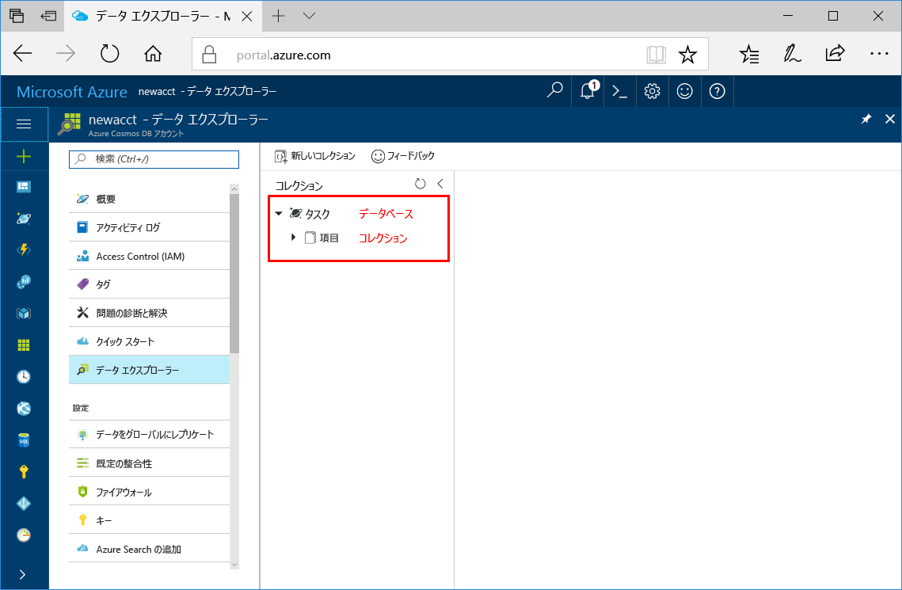

Azure Portal でデータ エクスプローラー ツールを使用してデータベースとコレクションを作成できるようになりました。 

1. **[データ エクスプローラー]** > **[新しいコレクション]** をクリックします。 
    
    **[コレクションの追加]** 領域が右端に表示されます。表示するには、右にスクロールする必要がある場合があります。

    ![Azure portal の [データ エクスプローラー] の [コレクションの追加] ウィンドウ](./media/cosmos-db-create-collection/azure-cosmosdb-data-explorer.png)

2. **[コレクションの追加]** ページで、新しいコレクションの設定を入力します。

    設定|推奨値|説明
    ---|---|---
    データベース ID|タスク|新しいデータベースの名前として*タスク*を入力します。 データベース名は 1 文字以上 255 文字以内にする必要があります。`/, \\, #, ?` は使えず、末尾にスペースを入れることもできません。
    コレクション ID|項目|新しいコレクションの名前として*項目*を入力します。 コレクション ID には、データベース名と同じ文字要件があります。
    パーティション キー| <Your partition key>| */userid* などのパーティション キーを入力します。
    スループット|400 RU|スループットを 400 要求ユニット (RU/秒) に変更します。 待ち時間を短縮する場合、後でスループットをスケールアップできます。 
    
    上記の設定に加え、必要に応じて、このコレクション用に**一意なキー**を追加できます。 この例では、このフィールドを空のままにしましょう。 一意なキーを使用すると、開発者はデータベースにデータ整合性のレイヤーを追加できます。 コレクションの作成中に一意キー ポリシーを作成すると、パーティション キーごとに 1 つ以上の値の一意性が保証されます。 詳細については、記事「[Azure Cosmos DB における一意なキー](../articles/cosmos-db/unique-keys.md)」を参照してください。
    
    Click **OK**.

    新しいデータベースとコレクションがデータ エクスプローラーに表示されます。

    