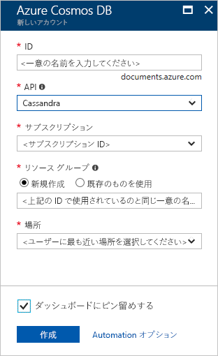

1. 新しいブラウザー ウィンドウで、[Azure Portal](https://portal.azure.com/) にサインインします。

2. 左側のメニューで、 **[リソースの作成]** を選択します。
   
   
   
3. **[新規]** ページで、 **[データベース]**  >  **[Azure Cosmos DB]** の順に選択します。
   
   ![Azure Portal の [データベース] ウィンドウ](./media/cosmos-db-create-dbaccount-cassandra/create-nosql-db-databases-json-tutorial-1.png)
   
3. **[Azure Cosmos DB アカウントの作成]** ページで、新しい Azure Cosmos DB アカウントの設定を入力します。 
 
    設定|Value|説明
    ---|---|---
    サブスクリプション|該当するサブスクリプション|この Azure Cosmos DB アカウントに使用する Azure サブスクリプションを選択します。 
    リソース グループ|新規作成  アカウント名と同じ名前を入力します|**[新規作成]** を選択します。 その後、自分のアカウントの新しいリソース グループの名前を入力します。 簡略化のため、Azure Cosmos アカウント名と同じ名前を使用します。 
    アカウント名|一意の名前を入力します|自分の Azure Cosmos DB アカウントを識別するための一意の名前を入力します。 アカウント URI は、一意のアカウント名に *cassandra.cosmos.azure.com* が追加されたものになります。  アカウント名に使用できるのは、小文字、数字、ハイフン (-) のみで、長さは 3 文字から 31 文字の範囲にする必要があります。
    API|Cassandra|API によって、作成するアカウントの種類が決まります。 Azure Cosmos DB には、5 種類の API が用意されています。ドキュメント データベース用の Core (SQL)、グラフ データベース用の Gremlin、ドキュメント データベース用の MongoDB、Azure Table、Cassandra です。 API ごとに別のアカウントを作成する必要があります。   このクイック スタートでは Cassandra API で動作するテーブルを作成しているため、**Cassandra** を選択します。   [Cassandra API に関する詳細を参照する](../articles/cosmos-db/cassandra-introduction.md)|
    Location|ユーザーに最も近いリージョンを選択|Azure Cosmos DB アカウントをホストする地理的な場所を選択します。 データに最も高速にアクセスできる、ユーザーに最も近い場所を使用します。

    **[確認および作成]** を選択します。 **[ネットワーク]** セクションと **[タグ]** セクションはスキップできます。 

    

4. アカウントの作成には数分かかります。 ポータルに "**設定完了。Azure Cosmos DB アカウントが作成されました**" というメッセージのページが表示されるまで待機します。

