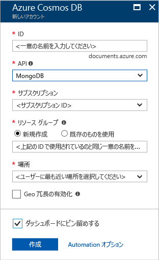
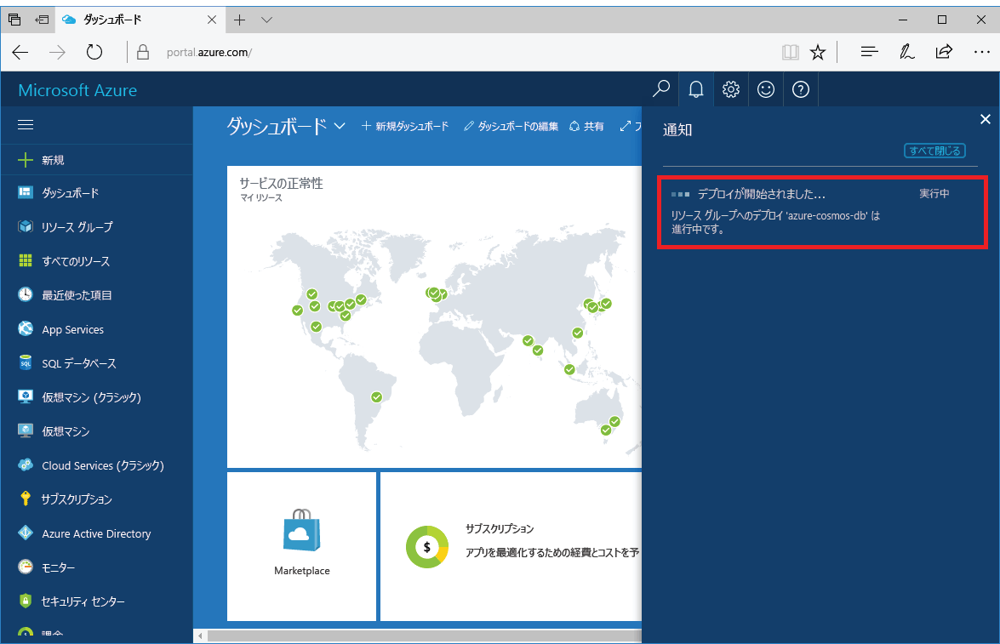

1. 新しいウィンドウで、[Azure Portal](https://portal.azure.com/) にサインインします。
2. 左側のメニューで、**[リソースの作成]**、**[データベース]** の順にクリックし、**[Azure Cosmos DB]** の下にある **[作成]** をクリックします。
   
   

3. **[新しいアカウント]** ウィンドウで、Azure Cosmos DB アカウントに必要な構成を指定します。 

    Azure Cosmos DB では、Gremlin (グラフ)、MongoDB、SQL、および Table (キー値) の 4 つのプログラミング モデルのいずれかを選択できます。 
       
    このクイック スタートでは、MongoDB API に対してプログラミングするため、フォームに入力する際に、**MongoDB** を選択します。 ただし、ソーシャル メディア アプリ用のグラフデータ、カタログ アプリからのドキュメント データ、またはキー/値 (テーブル) データを使用する場合は、Azure Cosmos DB によって、あらゆるミッションクリティカルなアプリケーションに、可用性の高い世界中に分散されたデータベース サービス プラットフォームを実現できます。

    表に記載した情報を参考にして、**[新しいアカウント]** ウィンドウに必要事項を入力します。
 
    
   
    Setting|推奨値|[説明]
    ---|---|---
    ID|*一意の値*|Azure Cosmos DB アカウントを識別するために選択した一意の名前。 指定した ID に *documents.azure.com* が付加されて URI が作成されるので、ID は一意であっても識別可能なものを使用してください。 ID には小文字、数字、'-' 文字のみを含めることができ、文字数は 3 ～ 50 文字にする必要があります。
    API|MongoDB|API によって、作成するアカウントの種類が決まります。 Azure Cosmos DB には、アプリケーションのニーズに応じて、SQL (ドキュメント データベース)、Gremlin (グラフ データベース)、MongoDB (ドキュメント データベース)、Azure Table、および Cassandra の 5 つの API が用意されています。現時点では、それぞれ別個のアカウントが必要です。   このクイック スタートでは、MongoDB を使用してクエリ可能なドキュメント データベースを作成するため、**MongoDB** を選択します。  [MongoDB API の詳細](../articles/cosmos-db/mongodb-introduction.md)|
    [サブスクリプション]|*該当するサブスクリプション*|Azure Cosmos DB アカウントに使用する Azure サブスクリプション。 
    リソース グループ|*ID と同じ値*|自分のアカウントの新しいリソース グループの名前。 簡略化のため、ID と同じ名前を使用することができます。 
    場所|*ユーザーに最も近いリージョン*|Azure Cosmos DB アカウントをホストする地理的な場所です。 データに最も高速にアクセスできる、ユーザーに最も近い場所を選択します。

4. **[作成]** をクリックしてアカウントを作成します。
5. ツール バーの **[通知]** をクリックして、デプロイ プロセスを監視します。

    

6.  デプロイが完了したら、[All Resources] \(すべてのリソース) タイルから、新しいアカウントを開きます。 

    ![[すべてのリソース] タイルの Azure Cosmos DB アカウント](./media/cosmos-db-create-dbaccount-mongodb/azure-documentdb-all-resources.png)
