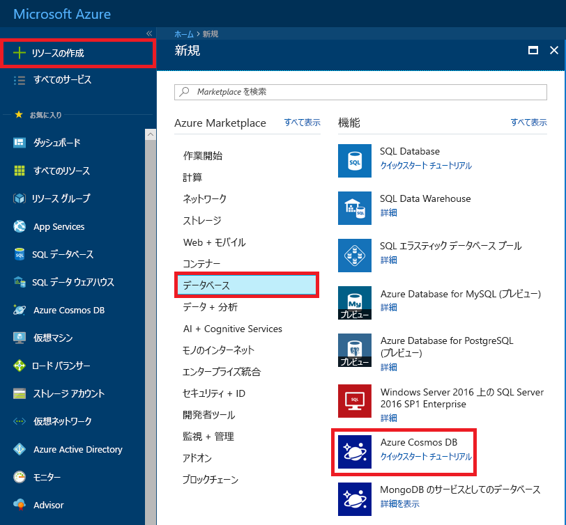
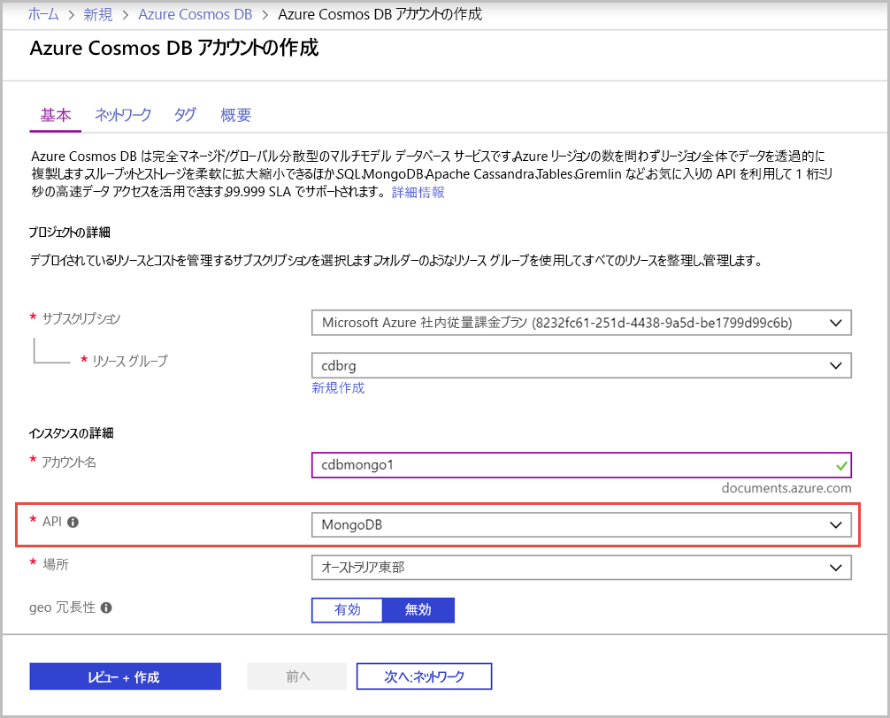

1. 新しいウィンドウで、[Azure Portal](https://portal.azure.com/) にサインインします。
2. 左側のメニューで、**[リソースの作成]**、**[データベース]** の順にクリックし、**[Azure Cosmos DB]** の下にある **[作成]** をクリックします。
   
   

3. **[新しいアカウント]** ブレードで、API として **MongoDB** を指定し、Azure Cosmos DB アカウントに必要な構成を入力します。
 
    * **[ID]** は、Azure Cosmos DB アカウントを識別するために使用する一意の名前である必要があります。 使用できる文字は、英小文字、数字、"-" のみです。文字数は 3 から 50 文字にする必要があります。
    * **[サブスクリプション]** は、自分の Azure サブスクリプションです。 自動的に入力されます。
    * **[リソース グループ]** は、Azure Cosmos DB アカウントのリソース グループ名です。 **新規作成**を選択してから、自分のアカウントの新しいリソースグループの名前を入力します。 簡略化のため、ID と同じ名前を使用することができます。
    * **[場所]** は、Azure Cosmos DB インスタンスが存在している地理的な場所です。 ユーザーに最も近い場所を選択します。

    **[Create]** をクリックします。

    

4. アカウントの作成には数分かかります。 ポータルに "**Azure Cosmos DB アカウントと MongoDB API の準備ができました。**" ページが表示されるまで待ちます。

    ![Azure Portal の [通知] ウィンドウ](./media/cosmos-db-create-dbaccount-mongodb/azure-cosmos-db-account-created.png)
