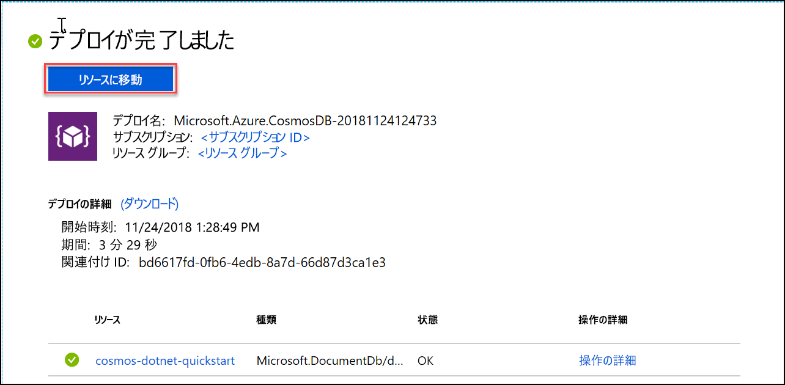

1. 新しいブラウザー ウィンドウで、[Azure Portal](https://portal.azure.com/) にサインインします。
2. **[リソースの作成]** > **[データベース]** > **[Azure Cosmos DB]** の順にクリックします。
   
   ![Azure Portal の [データベース] ウィンドウ](./media/cosmos-db-create-dbaccount/create-nosql-db-databases-json-tutorial-1.png)

3. **[Azure Cosmos DB アカウントの作成]** ページで、新しい Azure Cosmos DB アカウントの設定を入力します。 
 
    設定|値|説明
    ---|---|---
    サブスクリプション|*該当するサブスクリプション*|この Azure Cosmos DB アカウントに使用する Azure サブスクリプションを選択します。 
    リソース グループ|新規作成  <*一意の名前を入力*>|**新規作成**を選択してから、自分のアカウントの新しいリソースグループの名前を入力します。 簡略化のため、アカウント名と同じ名前を使用できます。 
    アカウント名|<*一意の名前を入力*>|自分の Azure Cosmos DB アカウントを識別するための一意の名前を入力します。 指定した ID に *documents.azure.com* が付加されて URI が作成されるので、一意の ID を使用してください。  ID に含めることができるのは英小文字、数字、およびハイフン (-) 文字のみで、文字数は 3 ～ 31 文字にする必要があります。
    API|コア (SQL)|API によって、作成するアカウントの種類が決まります。 Azure Cosmos DB には、5 種類の API が用意されています。Azure Cosmos DB では、SQL (ドキュメント データベース)、Gremlin (グラフ データベース)、MongoDB (ドキュメント データベース)、Table API、および Cassandra API です。 現在は、API ごとに個別のアカウントを作成する必要があります。   この記事ではドキュメント データベースを作成し、SQL 構文を使用してクエリを実行するため、**[コア SQL]** を選択します。   [SQL API について詳しくは、こちらをご覧ください](../articles/cosmos-db/documentdb-introduction.md)|
    場所|<*ユーザーに最も近いリージョンを選択*>|Azure Cosmos DB アカウントをホストする地理的な場所を選択します。 データに最も高速にアクセスできる、ユーザーに最も近い場所を使用します。
    Geo 冗長の有効化| 空白 | データベースのレプリケート バージョンが 2 番目 (ペア) のリージョンに作成されます。 空白のままにします。  
    マルチリージョンの書き込み| 空白 | これにより、データベースの各リージョンを、読み取りリージョンと書き込みリージョンの両方にすることができます 空白のままにします。  

    **[確認および作成]** をクリックします。 **[ネットワーク]** セクションと **[タグ]** セクションはスキップできます。 

    

    概要情報を確認し、**[作成]** をクリックします。 

    ![[概要] ページでのアカウントの確認](./media/cosmos-db-create-dbaccount/azure-cosmos-db-create-new-account-summary-preview.png)

4. アカウントの作成には数分かかります。 ポータルに**デプロイが完了した**ことを示すメッセージが表示されるまで待ってから、**[Go to resource]\(リソースに移動\)** をクリックします。     

    

5. ポータルに **[お疲れさまでした。Azure Cosmos DB アカウントが作成されました]** ページが表示されます。

    ![Azure Portal の [通知] ウィンドウ](./media/cosmos-db-create-dbaccount/azure-cosmos-db-account-created.png)

