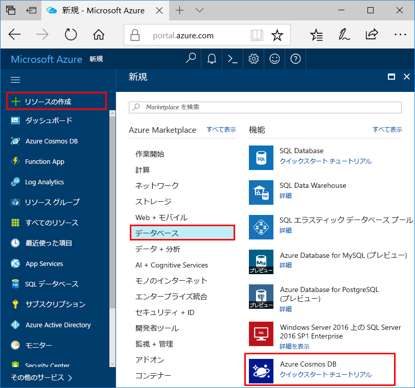

1. 新しいブラウザー ウィンドウで、[Azure Portal](https://portal.azure.com/) にサインインします。
2. 左側のナビゲーション ウィンドウで、 **[+ リソースの作成]** を選択します。 **[データベース]** を選択してから、 **[Azure Cosmos DB]** を選択します。
   
   

3. **[Azure Cosmos DB アカウントの作成]** ページで、新しい Azure Cosmos DB アカウントの設定を入力します。
 
    Setting|値|説明
    ---|---|---
    サブスクリプション|該当するサブスクリプション|この Azure Cosmos DB アカウントに使用する Azure サブスクリプションを選択します。 
    リソース グループ|新規作成  その後、ID で指定したものと同じ一意の名前を入力|**[新規作成]** を選択します。 その後、自分のアカウントの新しいリソース グループの名前を入力します。 簡略化するには、ID と同じ名前を使用します。 
    アカウント名|一意の名前を入力します|自分の Azure Cosmos DB アカウントを識別するための一意の名前を入力します。  ID に使用できるのは、英小文字、数字、ハイフン (-) のみです。 3 から 31 文字の長さにする必要があります。
    API|Azure テーブル|API によって、作成するアカウントの種類が決まります。 Azure Cosmos DB には、5 種類の API が用意されています。ドキュメント データベース用の Core(SQL)、グラフ データベース用の Gremlin、ドキュメント データベース用の MongoDB、Azure Table、Cassandra です。 現在は、API ごとに別のアカウントを作成する必要があります。   このクイックスタートでは Table API に対応するテーブルを作成するので、**Azure Table** を選択します。   [Table API の詳細](../articles/cosmos-db/table-introduction.md)|
    Location|ユーザーに最も近いリージョンを選択|Azure Cosmos DB アカウントをホストする地理的な場所を選択します。 データに最も高速にアクセスできるよう、お客様のユーザーに最も近い場所を使用します。

    追加の RU 料金を回避するために、 **[geo 冗長性]** オプションと **[マルチ リージョン書き込み]** オプションは既定値 ( **[無効]** ) のままにすることができます。 **[ネットワーク]** セクションと **[タグ]** セクションはスキップできます。

5. **[確認および作成]** を選択します。 検証が完了したら、 **[作成]** を選択してアカウントを作成します。 
 
   

6. アカウントの作成には数分かかります。 "**デプロイが進行中です**" というメッセージが表示されます。 デプロイが完了するまで待ってから、 **[リソースに移動]** を選択します。

    ![Azure portal の [通知] ウィンドウ](./media/cosmos-db-create-dbaccount-table/azure-cosmos-db-account-created.png)
