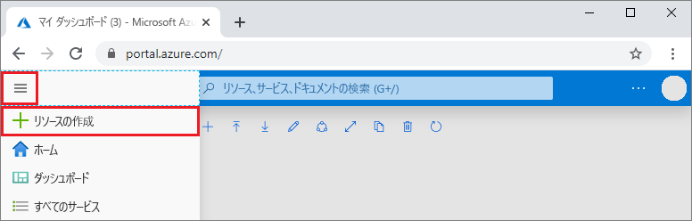
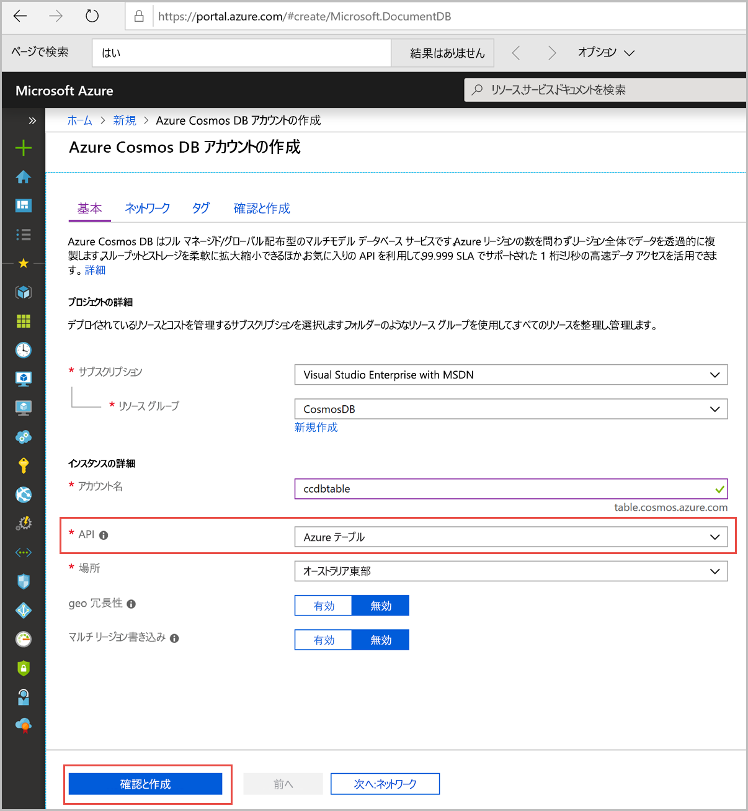

1. 新しいブラウザー ウィンドウで、[Azure Portal](https://portal.azure.com/) にサインインします。

2. 左側のメニューで、 **[リソースの作成]** を選択します。
   
   
   
3. **[新規]** ページで、 **[データベース]**  >  **[Azure Cosmos DB]** の順に選択します。
   
   ![Azure Portal の [データベース] ウィンドウ](./media/cosmos-db-create-dbaccount-table/create-nosql-db-databases-json-tutorial-1.png)
   
3. **[Azure Cosmos DB アカウントの作成]** ページで、新しい Azure Cosmos DB アカウントの設定を入力します。 
 
    設定|Value|説明
    ---|---|---
    サブスクリプション|該当するサブスクリプション|この Azure Cosmos DB アカウントに使用する Azure サブスクリプションを選択します。 
    リソース グループ|**[新規作成]** 、アカウント名|**[新規作成]** を選択します。 その後、自分のアカウントの新しいリソース グループの名前を入力します。 簡略化のため、Azure Cosmos DB アカウント名と同じ名前を使用します。 
    アカウント名|一意の名前|自分の Azure Cosmos DB アカウントを識別するための一意の名前を入力します。  アカウント名に使用できるのは、小文字、数字、ハイフン (-) のみで、長さは 3 文字から 31 文字の範囲にする必要があります。
    API|テーブル|API によって、作成するアカウントの種類が決まります。 Azure Cosmos DB には、5 種類の API が用意されています。ドキュメント データベース用の Core (SQL)、グラフ データベース用の Gremlin、ドキュメント データベース用の MongoDB、Azure Table、Cassandra です。 API ごとに別のアカウントを作成する必要があります。   このクイックスタートでは Table API で動作するテーブルを作成するので、**Azure Table** を選択します。   [Table API の詳細](../articles/cosmos-db/table-introduction.md)|
    Location|ユーザーに最も近いリージョン|Azure Cosmos DB アカウントをホストする地理的な場所を選択します。 データに最も高速にアクセスできる、ユーザーに最も近い場所を使用します。

    追加の料金を回避するために、 **[geo 冗長性]** オプションと **[マルチ リージョン書き込み]** オプションを **[無効]** のままにし、 **[ネットワーク]** および **[タグ]** セクションをスキップすることができます。

5. **[確認および作成]** を選択します。 検証が完了したら、 **[作成]** を選択してアカウントを作成します。 
 
   

6. アカウントの作成には数分かかります。 "**デプロイが進行中です**" というメッセージが表示されます。 デプロイが完了するまで待ってから、 **[リソースに移動]** を選択します。

    ![Azure portal の [通知] ウィンドウ](./media/cosmos-db-create-dbaccount-table/azure-cosmos-db-account-created.png)

