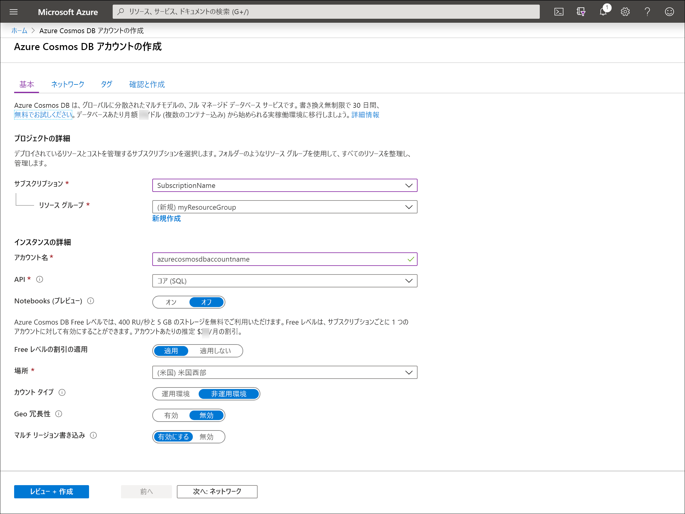

1. Azure portal のメニューまたは **[ホーム]** ページで、 **[リソースの作成]** を選択します。

1. **[新規]** ページで、 **[Azure Cosmos DB]** を検索して選択します。

1. **[Azure Cosmos DB]** ページで、 **[作成]** を選択します。

1. **[Azure Cosmos DB アカウントの作成]** ページで、新しい Azure Cosmos アカウントの基本的な設定を入力します。 

    |設定|値|説明 |
    |---|---|---|
    |サブスクリプション|サブスクリプション名|この Azure Cosmos アカウントに使用する Azure サブスクリプションを選択します。 |
    |リソース グループ|リソース グループ名|リソース グループを選択するか、 **[新規作成]** を選択し、新しいリソース グループの一意の名前を入力します。 |
    |アカウント名|一意の名前|自分の Azure Cosmos アカウントを識別するための名前を入力します。 指定した名前に *documents.azure.com* が付加されて URI が作成されるので、一意の名前を使用してください。  名前に含めることができるのは、英小文字、数字、ハイフン (-) のみです。 長さは 3 文字から 44 文字でなければなりません。|
    |API|作成するアカウントの種類。|ドキュメント データベースを作成し、SQL 構文を使用してクエリを実行するには、 **[コア (SQL)]** を選択します。   API によって、作成するアカウントの種類が決まります。 Azure Cosmos DB には、5 種類の API が用意されています。ドキュメント データ用のコア (SQL) と MongoDB、グラフ データ用の Gremlin、Azure Table、Cassandra です。 現在は、API ごとに別のアカウントを作成する必要があります。   [SQL API について詳しくは、こちらをご覧ください](../articles/cosmos-db/documentdb-introduction.md)。|
    |Apply Free Tier Discount (Free レベルの割引の適用)|[適用] または [適用しない]|Azure Cosmos DB Free レベルのアカウントでは、最初の 400 RU/秒と 5 GB のストレージを無料でご利用いただけます。 [Free レベル](https://azure.microsoft.com/pricing/details/cosmos-db/)の詳細を確認してください。|
    |場所|ユーザーに最も近いリージョン|Azure Cosmos DB アカウントをホストする地理的な場所を選択します。 データに最も高速にアクセスできるよう、お客様のユーザーに最も近い場所を使用します。|
    |アカウントの種類|[運用] または [Non-Production]\(非運用\)|アカウントが運用ワークロードに使用される場合は、 **[運用]** を選択します。 アカウントが非運用環境 (開発、テスト、QA、ステージングなど) に使用される場合は、 **[Non-Production]\(非運用\)** を選択します。 これは、ポータルでの操作を調整する Azure リソース タグの設定ですが、基になる Azure Cosmos DB アカウントには影響しません。 この値は、いつでも変更できます。|

    > [!NOTE]
    > Azure サブスクリプションにつき所有できる Free レベルの Azure Cosmos DB アカウントは 1 つまでです。また、アカウントの作成時にオプトインする必要があります。 Free レベルの割引を適用するオプションが表示されない場合は、サブスクリプション内の別のアカウントが Free レベルで既に有効になっていることを意味します。
   
   

1. **[Review + create]\(レビュー + 作成\)** を選択します。 **[ネットワーク]** セクションと **[タグ]** セクションはスキップできます。

1. アカウントの設定を確認し、 **[作成]** を選択します。 アカウントの作成には数分かかります。 ポータル ページに "**デプロイが完了しました**" と表示されるまで待ちます。 

    ![Azure Portal の [通知] ウィンドウ](./media/cosmos-db-create-dbaccount/azure-cosmos-db-account-created.png)

1. **[リソースに移動]** を選択し、Azure Cosmos DB アカウント ページに移動します。 

    
