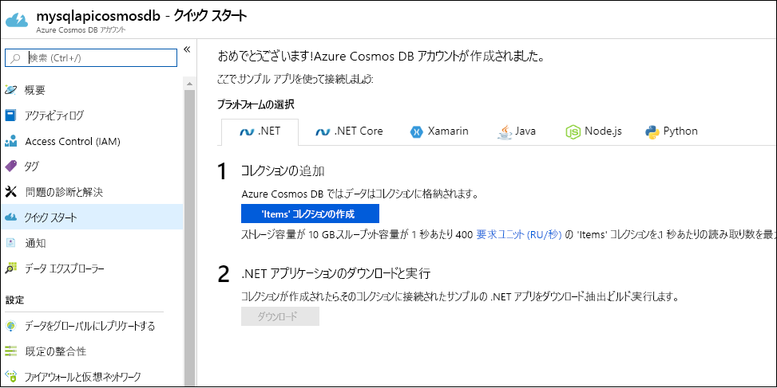

1. [Azure Portal](https://portal.azure.com/) にサインインします。
1. **[リソースの作成]**  >  **[データベース]**  >  **[Azure Cosmos DB]** を選択します。
   
   ![Azure Portal の [データベース] ウィンドウ](./media/cosmos-db-create-dbaccount/create-nosql-db-databases-json-tutorial-1.png)

1. **[Azure Cosmos DB アカウントの作成]** ページで、新しい Azure Cosmos アカウントの基本的な設定を入力します。 
 
    |Setting|値|説明 |
    |---|---|---|
    |Subscription|サブスクリプション名|この Azure Cosmos アカウントに使用する Azure サブスクリプションを選択します。 |
    |リソース グループ|リソース グループ名|リソース グループを選択するか、 **[新規作成]** を選択し、新しいリソース グループの一意の名前を入力します。 |
    | アカウント名|一意の名前を入力します|自分の Azure Cosmos アカウントを識別するための名前を入力します。 指定した ID に *documents.azure.com* が付加されて URI が作成されるので、一意の ID を使用してください。  ID に含めることができるのは、英小文字、数字、ハイフン (-) のみです。 長さは 3 文字から 31 文字でなければなりません。|
    | API|コア (SQL)|API によって、作成するアカウントの種類が決まります。 Azure Cosmos DB には、5 種類の API が用意されています。ドキュメント データ用のコア (SQL) と MongoDB、グラフ データ用の Gremlin、Azure Table、Cassandra です。 現在は、API ごとに別のアカウントを作成する必要があります。   ドキュメント データベースを作成し、SQL 構文を使用してクエリを実行するには、 **[コア (SQL)]** を選択します。   [SQL API について詳しくは、こちらをご覧ください](../articles/cosmos-db/documentdb-introduction.md)。|
    | Location|ユーザーに最も近いリージョンを選択|Azure Cosmos DB アカウントをホストする地理的な場所を選択します。 データに最も高速にアクセスできるよう、お客様のユーザーに最も近い場所を使用します。|
   
   

1. **[Review + create]\(レビュー + 作成\)** を選択します。 **[ネットワーク]** セクションと **[タグ]** セクションはスキップできます。 

1. アカウントの設定を確認し、 **[作成]** を選択します。 アカウントの作成には数分かかります。 ポータル ページに "**デプロイが完了しました**" と表示されるまで待ちます。 

    ![Azure Portal の [通知] ウィンドウ](./media/cosmos-db-create-dbaccount/azure-cosmos-db-account-created.png)

1. **[リソースに移動]** を選択し、Azure Cosmos DB アカウント ページに移動します。 

    
