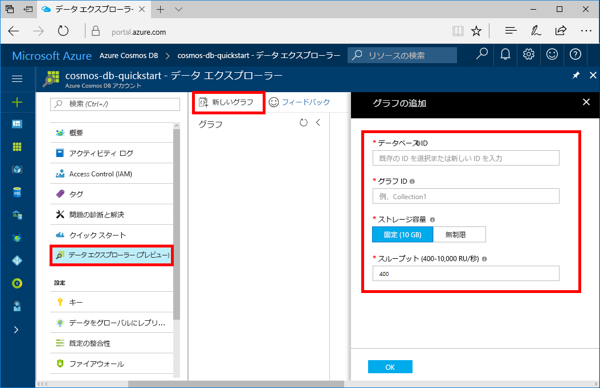

Azure Portal でデータ エクスプローラー ツールを使用してグラフ データベースを作成できるようになりました。 

1. Azure Portal の左側のメニューで、**[データ エクスプローラー (プレビュー)]** を選択します。

2. **[データ エクスプローラー (プレビュー)]** の **[New Graph]\(新しいグラフ\)** を選択します。 以下の情報を参考にして、このページに必要事項を入力してください。

    

    設定|推奨値|説明
    ---|---|---
    データベース ID|sample-database|新しいデータベースの ID。 データベース名は、1 ～ 255 文字である必要があります。また、`/ \ # ?` は使えず、末尾にスペースを入れることもできません。
    グラフ ID|sample-graph|新しいグラフの ID。 グラフ名の文字要件はデータベース ID と同じです。
    ストレージの容量| 10 GB|既定値をそのまま使用します。 これは、データベースの記憶域容量です。
    スループット|400 RU|既定値をそのまま使用します。 待ち時間を短縮する場合、後でスループットをスケールアップできます。
    パーティション キー|/userid|各パーティションに均等にデータを分散するパーティション キー。 効率の良いグラフを作成するためには、正しいパーティション キーを選択することが大切です。 詳細については、「[パーティション分割の設計](../articles/cosmos-db/partition-data.md#designing-for-partitioning)」を参照してください。

3. フォームに入力したら、**[OK]** を選択します。