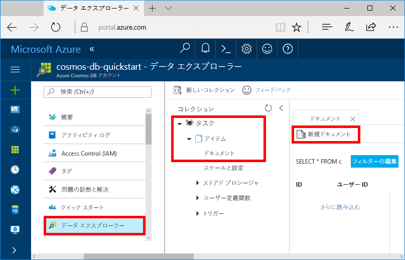

これで、データ エクスプローラーを使用して、新しいコレクションにデータを追加できます。

1. データ エクスプローラーで新しいデータベースが [コレクション] ウィンドウに表示されます。 **[タスク]** データベースを展開し、**[項目]** コレクションを展開して、**[ドキュメント]** をクリックし、**[新しいドキュメント]** をクリックします。 

   
  
2. ここで、次の構造のドキュメントをコレクションに追加します。

     ```json
     {
         "id": "1",
         "category": "personal",
         "name": "groceries",
         "description": "Pick up apples and strawberries.",
         "isComplete": false
     }
     ```

3. json を **[ドキュメント]** タブに追加したら、**[保存]** をクリックします。

    ![json データをコピーし、Azure Portal のデータ エクスプローラーで [保存] をクリックします。](./media/cosmos-db-create-sql-api-add-sample-data/azure-cosmosdb-data-explorer-save-document.png)

4.  もう 1 つドキュメントを作成して保存します。`id` プロパティには一意の値を挿入し、その他のプロパティについては適宜変更してください。 Azure Cosmos DB では、データにスキーマを課さないため、新しいドキュメントは必要な任意の構造にすることができます。