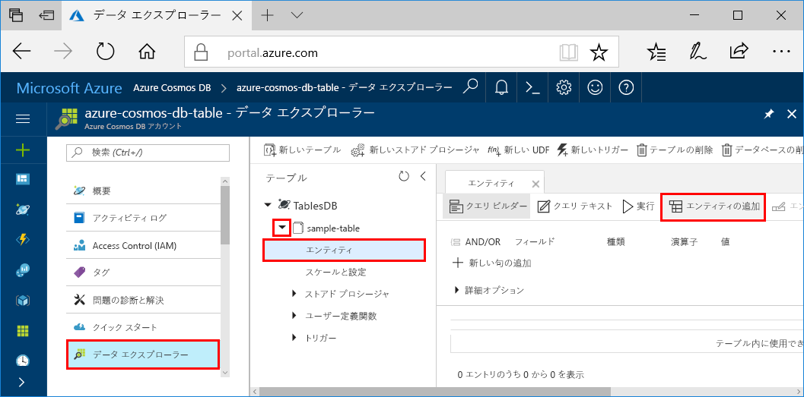
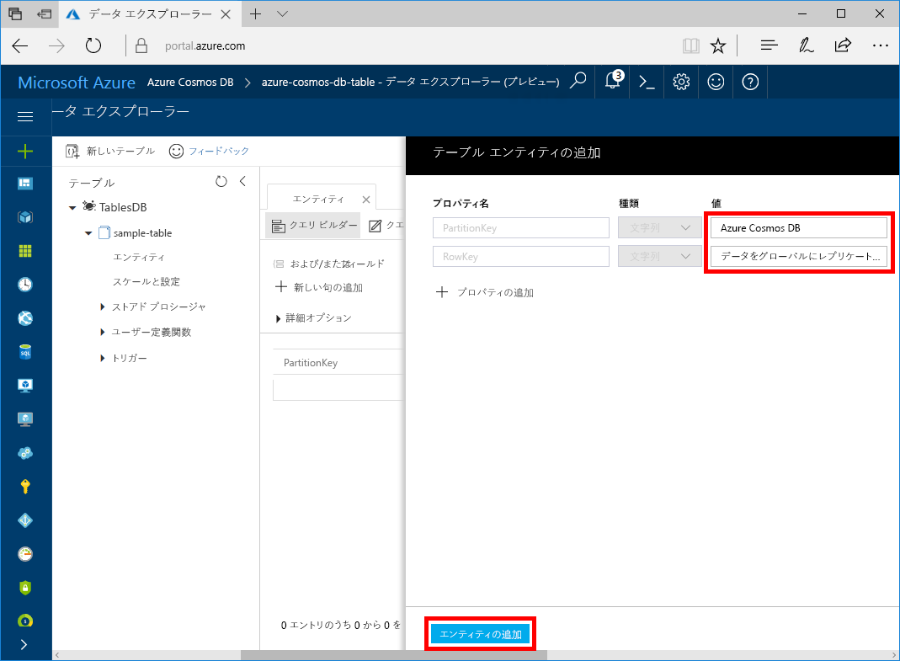

これで、データ エクスプローラーを使用して、新しいテーブルにデータを追加できます。

1. データ エクスプローラーで、**sample-table** を展開し、 **[エンティティ]** 、 **[エンティティの追加]** の順に選択します。

   

2. PartitionKey 値ボックスと RowKey 値ボックスにデータを追加し、 **[エンティティの追加]** を選択します。

   
  
    これで、テーブルにさらにエンティティを追加したり、エンティティを編集したり、データ エクスプローラーでデータをクエリしたりできます。 データ エクスプローラーでは、スループットを拡張し、ストアド プロシージャ、ユーザー定義関数、およびトリガーをテーブルに追加することもできます。