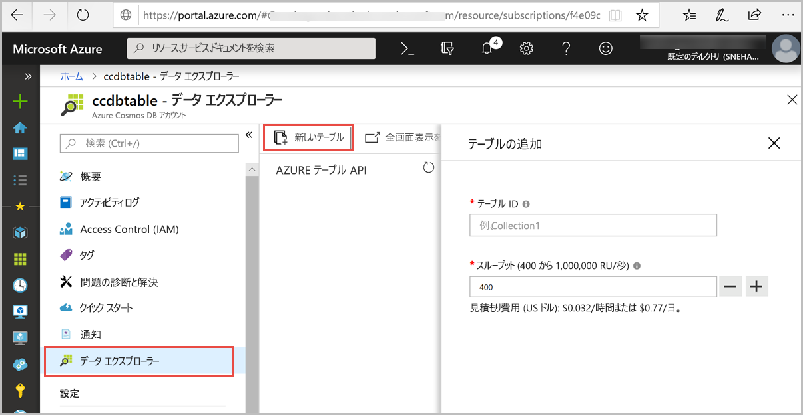
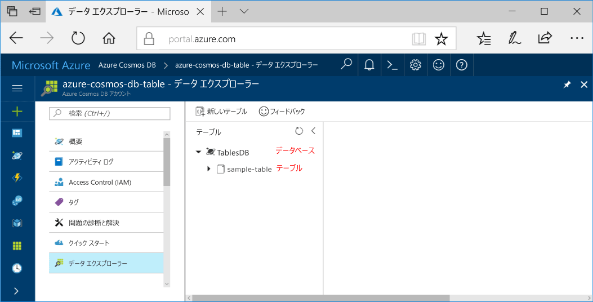

Azure Portal でデータ エクスプローラー ツールを使ってデータベースとテーブルを作成できるようになりました。 

1. **[データ エクスプローラー]** > **[新しいテーブル]** をクリックします。 
    
    **[テーブルの追加]** 領域が右端に表示されます。表示するには、右にスクロールする必要がある場合があります。

    

2. **[テーブルの追加]** ページで、新しいテーブルの設定を入力します。

    Setting|推奨値|説明
    ---|---|---
    テーブル ID|sample-table|新しいテーブルの ID。 テーブル名の文字要件はデータベース ID と同じです。 データベース名は、1 - 255 文字である必要があります。また、`/ \ # ?` は使えず、末尾にスペースを入れることもできません。
    ストレージの容量| 固定 (10 GB)|既定値の **[固定 (10 GB)]** を使用します。 この値は、データベースの記憶域容量です。
    Throughput|400 RU|スループットを 400 要求ユニット (RU/秒) に変更します。 待ち時間を短縮する場合、後でスループットをスケールアップできます。

    Click **OK**.

    新しいデータベースとテーブルがデータ エクスプローラーに表示されます。

    