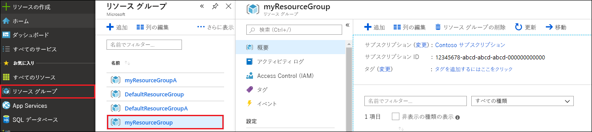
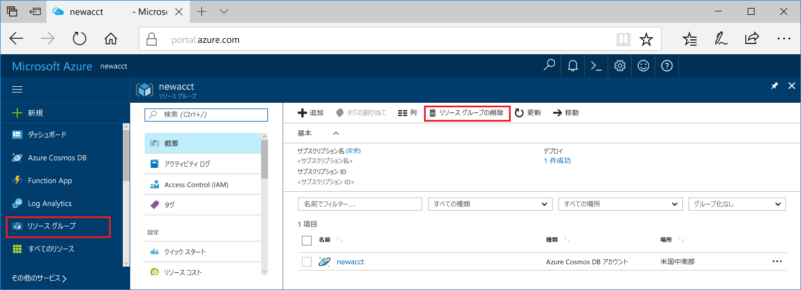

Web アプリと Azure Cosmos DB アカウントの使用を完了したら、それ以上料金がかからないように、作成した Azure リソースを削除できます。 リソースを削除するには、次の手順に従います。

1. Azure Portal で、左端にある **[リソース グループ]** を選択します。 左側のメニューが折りたたまれている場合は、を選択して展開します。

2. このクイック スタートで作成したリソース グループを選択します。  

   

2. 新しいウィンドウで、 **[リソース グループの削除]** を選択します。

      

3. 次のウィンドウで、削除するリソース グループの名前を入力し、 **[削除]** を選択します。

