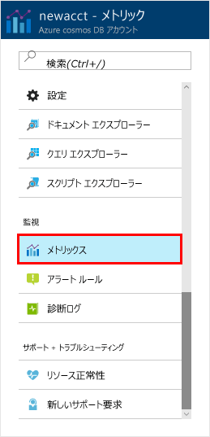

Azure ポータルでは、アカウント内のスループット、ストレージ、可用性、待機時間、およびリソースの整合性が監視されます。 これらのメトリックを簡単に見てみましょう。 

1. ナビゲーション メニューで **[メトリック]** をクリックします。

   

2. 各タブをクリックして、Azure Cosmos DB が提供するメトリックを確認します。 

    [Azure Cosmos DB サービス レベル アグリーメント (SLA)](https://azure.microsoft.com/support/legal/sla/cosmos-db/) に関連付けられているそれぞれのグラフは、SLA のいずれかに違反していることを示す情報を提供します。 Azure Cosmos DB は、この一連のメトリックを使用して SLA の監視を透明化します。 

   