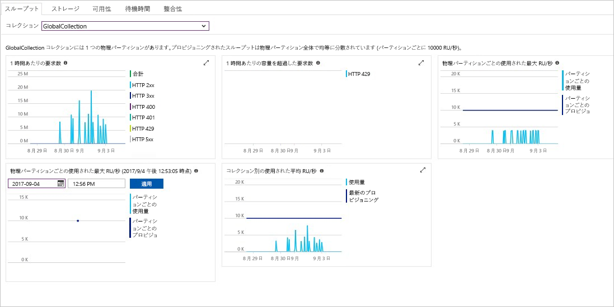

Azure portal では、Cosmos DB アカウントのスループット、ストレージ、可用性、待ち時間、および一貫性が監視されます。 [Azure Cosmos DB サービス レベル アグリーメント (SLA)](https://azure.microsoft.com/support/legal/sla/cosmos-db/) に関連付けられたメトリックのグラフに、実際のパフォーマンスと比較された SLA の値が示されます。 この一連のメトリックによって、SLA の監視が透明化されます。

メトリックと SLA を確認するには: 

1. Cosmos DB アカウントのナビゲーション メニューで **[メトリック]** を選択します。
   
2. **[待機時間]** など、タブを選択し、右側で期間を選択します。 グラフ上の **[実際]** と **[SLA]** の線を比較します。
   
   
   
3. 他のタブでメトリックを確認します。 

