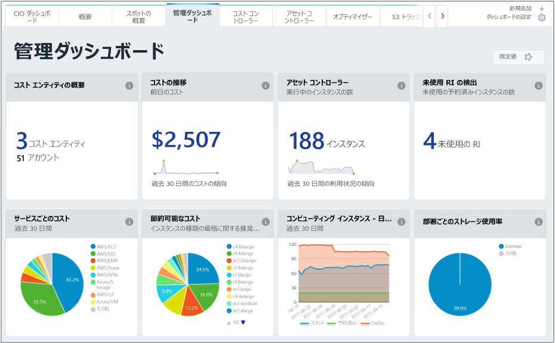
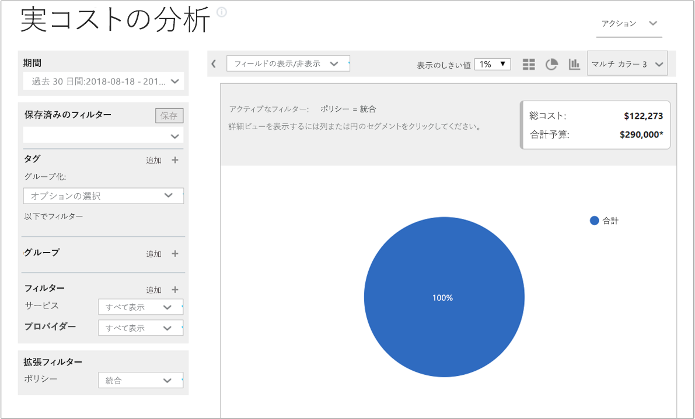
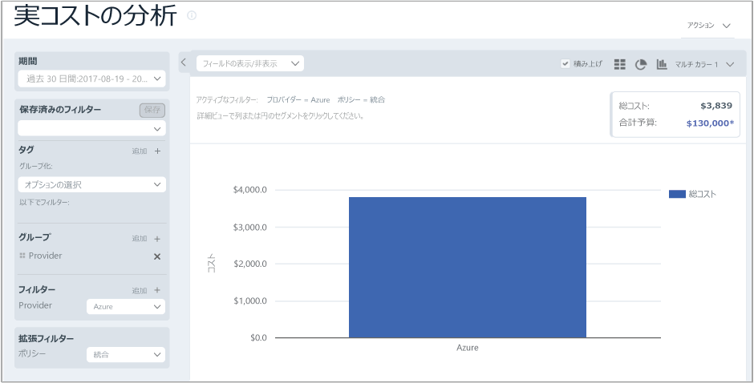
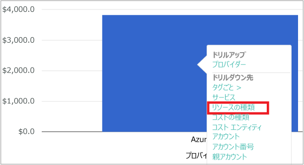
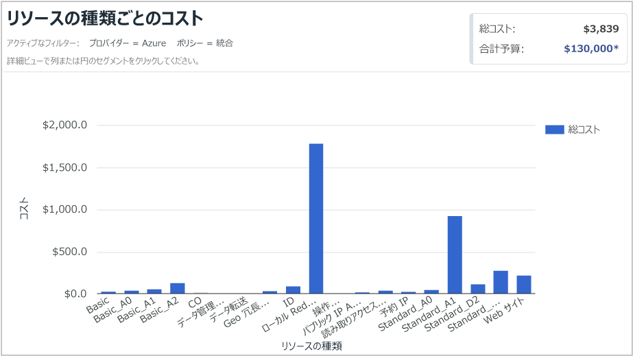
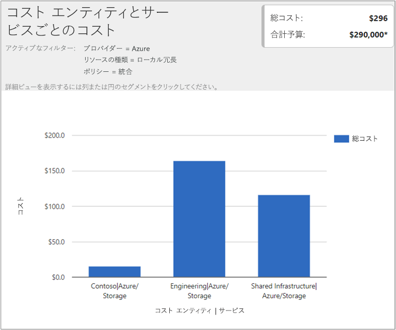

## コスト データの表示

Cloudyn による Azure コスト管理では、すべてのクラウド リソース データへのアクセスを提供します。 ダッシュボード レポートから、タブ付きビューで標準およびカスタムの両方のレポートを表示できます。 以下は、人気のあるダッシュボードと、コスト データをすばやく表示するレポートの例です。

この例では、管理ダッシュボードは、すべてのクラウド リソースにわたる Contoso ビジネスの統合されたコストを示しています。 Contoso では、Azure、AWS、および Google を使用しています。 ダッシュボードでは、情報をひと目で確認し、レポートに簡単に移動することができます。  

ダッシュボードでのレポートの目的がわからない場合は、**i** 記号にポインターを置くと説明が表示されます。 完全なレポートを表示するには、ダッシュボード上の任意のレポートをクリックします。

ポータルの上部にあるレポート メニューを使用して、レポートを表示することもできます。 過去 30 日間の Contoso の Azure リソースの使用について見てみましょう。 **[コスト]**  >  **[コスト分析]**  >  **[Actual Cost Analysis (実績コストの分析)]** をクリックします。 レポートにタグ、グループ、またはフィルターのセットがある場合は、値をクリアします。

この例では、$122,273 が総コストで、予算は $290,000 です。

ここで、レポートの書式を変更し、グループおよびフィルターを設定して、Azure コストの結果を絞り込んでみましょう。 **日付範囲**を過去 30 日間に設定します。 右上で、列の記号をクリックして棒グラフとして書式設定し、[グループ] で **[プロバイダー]** を選択します。 次に、 **[プロバイダー]** のフィルターを **[Azure]** に設定します。

この例では、Azure リソースの合計コストは過去 30 日間で $3,309 でした。

プロバイダー (Azure) バーを右クリックし、 **[リソースの種類]** にドリルダウンします。

次の図は、Contoso に発生した Azure リソースのコストを示しています。 合計は $3,309 でした。 この例では、約半分のコストが Standard_A1 VM に費やされ、残りの半分がさまざまな Azure サービスや VM インスタンスに費やされていました。

リソースの種類を右クリックし、 **[コスト エンティティ]** を選択して、コスト エンティティと、リソースを消費したサービスを表示します。 次の図では、ローカル冗長ストレージが、リソースの種類として設定されています。 Contoso |Azure/Storage では、$15.65 が消費されました。 エンジニアリング |Azure Storage では、$164.25 が消費されました。 共有インフラストラクチャ |Azure/Storage では、$116.58 が消費されました。 サービスの総コストは、$296 です。

クラウド請求データの表示に関するチュートリアル ビデオは、「[Analyzing your cloud billing data with Azure Cost Management Powered by Cloudyn](https://youtu.be/G0pvI3iLH-Y)」(Cloudyn による Azure Cost Management を使用したクラウドの課金データの分析) をご覧ください。
