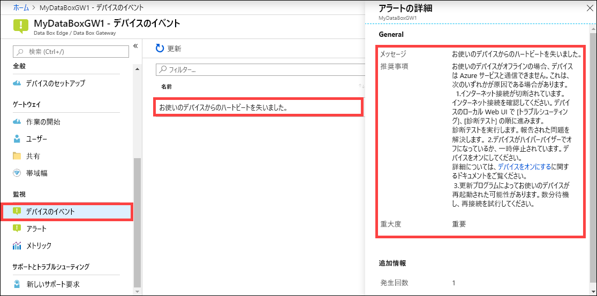

デバイス イベントを確認するには、Azure portal から次の手順を実行します。 

1. Azure portal からお使いの Azure Stack Edge/Data Box Gateway リソースに移動し、 **[監視] > [デバイスのイベント]** の順に移動します。
2. イベントを選択して、アラートの詳細を確認します。 適切な措置を講じてアラート状態を解決してください。

    