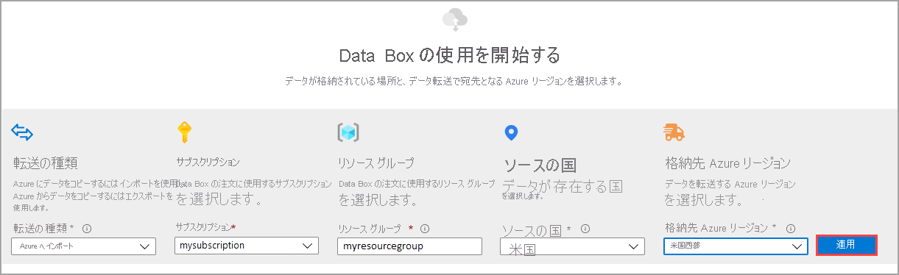

デバイスを注文するには、Azure portal で次の手順を実行します。

1. Microsoft Azure 資格情報を使用して、次の URL にサインインします。[https://portal.azure.com](https://portal.azure.com)
2. **[+ リソースの作成]** を選択し、*Azure Data Box* を検索します。 **[Azure Data Box]** を選択します。

   ![[新規] セクションのスクリーンショット。検索フィールドに「Azure Data Box」と入力されています](media/data-box-order-portal/data-box-import-01.png)

3. **［作成］** を選択します  

   ![Azure Data Box のスクリーンショット。[作成] オプションが強調表示されています](media/data-box-order-portal/data-box-import-02.png)

4. ご利用のリージョンで Data Box サービスが利用可能かどうかを確認します。 次の情報を入力または選択し、 **[適用]** を選択します。

    |設定  |値  |
    |---------|---------|
    |転送の種類     | **[Azure へインポート]** を選択します。        |
    |サブスクリプション     | Data Box サービス用の EA、CSP、または Azure スポンサー サブスクリプションを選択します。   サブスクリプションは、課金アカウントにリンクされます。       |
    |Resource group | 既存のリソース グループを選択します。 リソース グループとは、まとめて管理したり、デプロイしたりできるリソースの論理コンテナーです。 |
    |ソースの国/地域    |    データが現在存在する国/地域を選択します。         |
    |宛先 Azure リージョン     |     データを転送する Azure リージョンを選択します。   詳細については、[Data Box を利用可能なリージョン](../articles/databox/data-box-overview.md#region-availability)または [Data Box Heavy を利用可能なリージョン](../articles/databox/data-box-heavy-overview.md#region-availability)に関するページを参照してください。  |

    

5. 注文する **Data Box** 製品を選択します。下記に示すように、Data Box、Data Box Heavy のいずれかを選択します。 

    [ ![Azure Data Box 製品を選択する画面を示すスクリーンショット。Data Box の [選択] ボタンが強調表示されています。](media/data-box-order-portal/data-box-import-04.png) ](media/data-box-order-portal/data-box-import-04.png#lightbox)

    Data Box の場合、1 回の注文で使用可能な最大容量は 80 TB です。 Data Box Heavy の場合、1 回の注文で使用可能な最大容量は 770 TB です。 データ サイズがこれより大きい場合は、複数の注文を作成できます。

    **[Data Box Heavy]** を選択した場合、ご利用のリージョンにおけるデバイスの利用の可否が Data Box チームによってチェックされます。 注文を続行できる場合は通知されます。

6. **[注文]** で、 **[基本]** タブに移動します。次の情報を入力または選択します。 次に、 **[次へ: データの格納先 >]** を選択します。

    |設定  |[値]  |
    |---------|---------|
    |サブスクリプション      | サブスクリプションは、前の選択に基づいて自動的に設定されます。|
    |Resource group    | 前に選択したリソース グループ。 |
    |Import order name (インポート注文名) | 注文を追跡するためのフレンドリ名を指定します。 <ul><li>名前の長さは 3 から 24 文字で、文字、数字、またはハイフンにすることができます。</li><li>名前の最初と最後は、文字か数字とする必要があります。</li></ul>    |

    ![入力例と共に Data Box 注文の [基本] 画面を示すスクリーンショット。 [基本] タブと [次へ: データの格納先] ボタンが強調表示されています。](media/data-box-order-portal/data-box-import-05.png)

7. **[データの格納先]** 画面で、**データの格納先** (ストレージ アカウントまたはマネージド ディスク) を選択します。

    格納先として **ストレージ アカウント** を使用している場合は、次の画面が表示されます。

    ![格納先を [ストレージ アカウント] とした Data Box 注文の [データの格納先] 画面のスクリーンショット。 [データの格納先] タブ、[ストレージ アカウント]、[次へ: セキュリティ] ボタンが強調表示されています。](media/data-box-order-portal/data-box-import-06.png)

    指定した Azure リージョンに基づいて、既存のストレージ アカウントのフィルター処理された一覧から 1 つまたは複数のストレージ アカウントを選択します。 Data Box は、最大 10 個のストレージ アカウントにリンクできます。 新しい **汎用 v1 アカウント**、**汎用 v2 アカウント**、または **Blob Storage アカウント** を作成することもできます。

   > [!NOTE]
   > - Azure Premium FileStorage アカウントを選択した場合、ストレージ アカウント共有にプロビジョニングされたクォータは、ファイル共有にコピーされるデータのサイズまで増えます。 クォータが増やされた後に、たとえば、なんらかの理由で Data Box がデータをコピーできなくても、クォータは再度調整されません。
   > - このクォータは課金に使用されます。 データをデータセンターにアップロードしたら、ニーズに合わせてクォータを調整する必要があります。 詳細については、[課金の概要](../articles/storage/files/understanding-billing.md)に関する記事をご覧ください。

    仮想ネットワークに対するストレージ アカウントがサポートされます。 セキュリティで保護されたストレージ アカウントと Data Box サービスとを連携させるには、ストレージ アカウントのネットワーク ファイアウォール設定内で、信頼できるサービスを有効にします。 詳細については、[Azure Data Box を信頼できるサービスとして追加する](../articles/storage/common/storage-network-security.md#exceptions)方法を参照してください。

    Data Box を使用して、オンプレミスの仮想ハード ディスク (VHD) から **マネージド ディスク** を作成する場合は、以下の情報も指定する必要があります。

    |設定  |値  |
    |---------|---------|
    |リソース グループ     | オンプレミスの VHD からマネージド ディスクを作成する場合は、新しい リソース グループを作成します。 既存のリソース グループを使用できるのは、Data Box サービスでマネージド ディスクの Data Box 注文を作成するときに、そのリソース グループが既に作成されていた場合に限られます。   複数のリソース グループを指定するときは、各リソース グループをセミコロンで区切ります。 サポートされるリソース グループは、最大 10 個です。|

    ![格納先を [マネージド ディスク] とした Data Box 注文の [データの格納先] タブのスクリーンショット。 [データの格納先] タブ、[マネージド ディスク]、[次へ: セキュリティ] ボタンが強調表示されています。](media/data-box-order-portal/data-box-import-07.png)

    マネージド ディスクに指定されたストレージ アカウントは、ステージング ストレージ アカウントとして使用されます。 VHD は、Data Box サービスにより、ページ BLOB としてステージング ストレージ アカウントにアップロードされた後、マネージド ディスクに変換され、リソース グループに移動されます。 詳細については、「[Azure へのデータのアップロードを確認する](../articles/databox/data-box-deploy-picked-up.md#verify-data-upload-to-azure)」を参照してください。

   > [!NOTE]
   > ページ BLOB は、正常にマネージド ディスクに変換されなかった場合、ストレージ アカウントに残るため、ストレージの使用料が課金されます。

8. **[次へ: セキュリティ>]** を選択して続行します。

    **[セキュリティ]** 画面では、独自の暗号化キーと独自のデバイスを使用してパスワードを共有でき、二重暗号化を使用することを選択できます。

    **[セキュリティ]** 画面の設定はすべてオプションです。 設定を変更しない場合は、既定の設定が適用されます。

    ![Data Box インポート注文の [セキュリティ] タブのスクリーンショット。 [セキュリティ] タブが強調表示されています。](media/data-box-order-portal/data-box-import-08.png)

9. 独自のカスタマー マネージド キーを使用して新しいリソースのロック解除パスキーを保護する場合は、 **[暗号化の種類]** を展開します。

    Azure Data Box のカスタマー マネージド キーの構成は省略可能です。 Data Box では、既定で Microsoft マネージド キーを使用してロック解除パスキーが保護されます。

    カスタマー マネージド キーは、デバイス上のデータの暗号化方法には影響しません。 キーは、デバイスのロック解除パスキーを暗号化するためにのみ使用されます。

    カスタマー マネージド キーを使用しない場合は、手順 15 に進んでください。

   ![Data Box 注文ウィザードの [セキュリティ] タブのスクリーンショット。 [暗号化の種類] の設定が展開され、強調表示されています。](./media/data-box-order-portal/customer-managed-key-01.png)

10. カスタマー マネージド キーを使用するには、キーの種類として **[カスタマー マネージド キー]** を選択します。 次に、 **[キー コンテナーとキーを選択します]** を選択します。
   
    ![Data Box 注文の [セキュリティ] タブの [暗号化の種類] 設定のスクリーンショット。 [キー コンテナーとキーを選択します] リンクが強調表示されています。](./media/data-box-order-portal/customer-managed-key-02.png)

11. **[Azure Key Vault からのキーの選択]** ブレードで、次の操作を行います。

    - **[サブスクリプション]** は自動的に設定されます。

    - **[キー コンテナー]** で、ドロップダウン リストから既存のキー コンテナーを選択できます。

      ![Data Box 注文の [セキュリティ] タブの [暗号化の種類] 設定のスクリーンショット。 [カスタマー マネージド キー] オプションと [キー コンテナーとキーを選択します] リンクが選択されています。](./media/data-box-order-portal/customer-managed-key-03.png)

      または、新しいキー コンテナーを作成する場合は、 **[新しいキー コンテナーの作成]** を選択します。 
    
      ![Data Box 注文の [セキュリティ] タブの [暗号化の種類] 設定のスクリーンショット。 [新しいキー コンテナーの作成] リンクが強調表示されています。](./media/data-box-order-portal/customer-managed-key-04.png)      

      次に、 **[キー コンテナーの作成]** 画面で、リソース グループとキー コンテナ―名を入力します。 **[論理的な削除]** と **[消去保護]** が有効になっていることを確認します。 他のすべての既定値をそのまま使用し、 **[確認および作成]** を選択します。

      ![Data Box 注文の [キー コンテナーの作成] 画面のスクリーンショット。 [リソース グループ] と [キー コンテナ―名] が強調表示されています。 [論理的な削除] と [消去保護] が有効になっています。](./media/data-box-order-portal/customer-managed-key-05.png)

      キー コンテナーの情報を確認し、 **[作成]** を選択します。 キー コンテナーの作成が完了するまで数分待ちます。

      ![Azure の [キー コンテナーの作成] ウィザードの [確認と作成] タブのスクリーンショット。 [作成] ボタンが強調表示されています。](./media/data-box-order-portal/customer-managed-key-06.png)

12. **[キーの選択]** ブレードに、選択したキー コンテナーが表示されます。

    ![Azure Key Vault の [キーの選択] 画面のスクリーンショット。 [キー コンテナー] フィールドが強調表示されています。](./media/data-box-order-portal/customer-managed-key-07.png)

    新しいキーを作成する場合は、 **[Create new key]\(新しいキーを作成する\)** を選択します。 RSA キーを使用する必要があります。 サイズは 2,048 以上にすることができます。 新しいキーの名前を入力し、他の既定値をそのまま使用して、 **[作成]** を選択します。

      ![キー名が入力された Azure Key Vault の [キーの作成] 画面のスクリーンショット。 [名前] フィールドと [作成] ボタンが強調表示されています。](./media/data-box-order-portal/customer-managed-key-08.png)

      キーがキー コンテナーに作成されると通知されます。 新しいキーが選択され、 **[キーの選択]** ブレードに表示されます。

13. 使用するキーの **バージョン** を選択し、 **[選択]** を選択します。

      ![Azure Key Vault の [キーの作成] 画面のスクリーンショット。 [バージョン] フィールドが強調表示され、使用可能なバージョンが表示されています。](./media/data-box-order-portal/customer-managed-key-09.png)

    新しいキー バージョンを作成する場合は、 **[新しいバージョンの作成]** を選択します。

    ![Azure Key Vault の [キーの作成] 画面のスクリーンショット。 [新しいバージョンの作成] リンクが強調表示されています。](./media/data-box-order-portal/customer-managed-key-10.png)

    新しいキー バージョンの設定を選択し、 **[作成]** を選択します。

    ![サンプルのフィールド設定を含む、Azure Key Vault の [キーの作成] ダイアログ ボックスのスクリーンショット。 [作成] ボタンが強調表示されています。](./media/data-box-order-portal/customer-managed-key-11.png)

    **[セキュリティ]** 画面の **[暗号化の種類]** 設定に、キー コンテナーとキーが表示されます。

    ![Data Box インポート注文の [セキュリティ] タブのスクリーンショット。 [暗号化の種類] の設定で [キー コンテナーとキー] が強調表示されています。](./media/data-box-order-portal/customer-managed-key-12.png)

14. このリソースへのアクセスを管理するために使用するユーザー ID を選択します。 **[Select a user identity]\(ユーザー ID を選択する\)** を選択します。 右側のパネルで、使用するサブスクリプションとマネージド ID を選択します。 次に **[選択]** を選択します。

    ユーザー割り当てマネージド ID は、複数のリソースを管理するために使用できるスタンドアロンの Azure リソースです。 詳細については、[マネージド ID の種類](../articles/active-directory/managed-identities-azure-resources/overview.md)に関するページを参照してください。  

    新しいマネージド ID を作成する必要がある場合は、「[Azure portal を使用してユーザー割り当てマネージド ID を作成、一覧表示、削除したり、それにロールを割り当てたりする](../articles/active-directory/managed-identities-azure-resources/how-to-manage-ua-identity-portal.md)」のガイダンスに従ってください。
    
    ![Data Box 注文の [ユーザー割り当て済みマネージド ID の選択] パネルを表示する [セキュリティ] タブのスクリーンショット。 [サブスクリプション] と [選択した ID] フィールドが強調表示されています。](./media/data-box-order-portal/customer-managed-key-13.png)

    ユーザー ID が **[暗号化の種類]** の設定に表示されます。

    ![Data Box インポート注文の [セキュリティ] タブのスクリーンショット。 [暗号化の種類] の設定で選択したユーザー ID が強調表示されています。](./media/data-box-order-portal/customer-managed-key-14.png)

15. Azure Data Box で既定で使用される、システムによって生成されるパスワードを使用したくない場合は、 **[セキュリティ]** 画面の **[Bring your own password]\(独自のパスワードを使用する\)** を展開します。

    システムによって生成されるパスワードは安全であるため、組織で特に必要な場合を除いて推奨されます。

    ![Data Box 注文で [セキュリティ] タブの [Bring your own password]\(独自のパスワードを使用する\) が展開されているスクリーンショット。 [セキュリティ] タブとパスワードのオプションが強調表示されています。](media/data-box-order-portal/bring-your-own-password-01.png) 

   - 新しいデバイスに独自のパスワードを使用するには、 **[Set preference for the device password]\(デバイス パスワードの基本設定の設定\)** で、 **[Use your own password]\(独自のパスワードを使用する\)** を選択し、セキュリティ要件を満たすパスワードを入力します。
     
     パスワードは、大文字、小文字、特殊文字、および数字をそれぞれ 1 文字以上含む 12 から 15 文字の英数字である必要があります。

     - 使用できる特殊文字: @ # - $ % ^ ! + = ; : _ ( )
     - 使用できない文字: I i L o O 0
   
     ![Data Box 注文の [セキュリティ] タブの [Bring your own password]\(独自のパスワードを使用する\) オプションのスクリーンショット。 [Bring your own password]\(独自のパスワードを使用する\) オプションと [デバイスのパスワード] オプションが強調表示されています。](media/data-box-order-portal/bring-your-own-password-02.png)

 - 共有に独自のパスワードを使用するには:

   1. **[Set preference for the share passwords]\(共有パスワードの基本設定の設定\)** で、 **[Use your own passwords]\(独自のパスワードを使用する\)** を選択し、次に **共有のパスワードを選択** します。
     
       ![Data Box 注文の [セキュリティ] タブで、独自の共有パスワードを使用するオプションのスクリーンショット。 [独自のパスワードを使用する] オプションと [Select Passwords for the Shares]\(共有のパスワードを選択する\) オプションが強調表示されています。](media/data-box-order-portal/bring-your-own-password-03.png)

    1. 注文内の各ストレージ アカウントのパスワードを入力します。 パスワードは、ストレージ アカウントのすべての共有で使用されます。
    
       パスワードは、大文字、小文字、特殊文字、および数字をそれぞれ 1 文字以上含む 12 から 64 文字の英数字である必要があります。

       - 使用できる特殊文字: @ # - $ % ^ ! + = ; : _ ( )
       - 使用できない文字: I i L o O 0
     
    1. すべてのストレージ アカウントに同じパスワードを使用するには、 **[Copy to all]\(すべてにコピー\)** を選択します。 

    1. 終了したら、 **[保存]** を選択します。
     
       ![Data Box 注文の [Set Share Password]\(共有パスワードの設定\) 画面のスクリーンショット。 [Copy to all]\(すべてにコピー\) リンクと [保存] ボタンが強調表示されています。](media/data-box-order-portal/bring-your-own-password-04.png)

    **[セキュリティ]** 画面で、 **[View or change passwords]\(パスワードの表示または変更\)** を使用してパスワードを変更できます。

16. **[セキュリティ]** で、ソフトウェアベースの二重暗号化を有効にしたい場合は、 **[Double-encryption (for highly secure environments)]\(二重暗号化 (高度にセキュリティ保護された環境用)\)** を展開し、 **[Enable double encryption for the order]\(この注文に関して二重暗号化を有効にする\)** を選択します。

    ![Data Box 注文の [セキュリティ] タブの [二重暗号化] オプションのスクリーンショット。 [Enable Double Encryption For The Order]\(この注文に関して二重暗号化を有効にする\) オプションと [Next: Contact Details]\(次へ: 連絡先の詳細\) ボタンが強調表示されています。](media/data-box-order-portal/double-encryption-01.png)

    Data Box 上のデータに対し、AES-256 ビットの暗号化に加えて、ソフトウェアベースの暗号化が実行されます。

    > [!NOTE]
    > このオプションを有効にすると、注文の処理とデータのコピーにかかる時間が長くなることがあります。 注文後に、このオプションを変更することはできません。

    **[Next: Contact details>]\(次へ: 連絡先の詳細>\)** を選択して続行します。

17. **[連絡先の詳細]** で、 **[+ 住所の追加]** を選択します。

    ![Data Box 注文の [連絡先の詳細] タブのスクリーンショット。 [連絡先の詳細] タブと [+ 住所の追加] オプションが強調表示されています。](media/data-box-order-portal/contact-details-01.png)

18. **[住所の追加]** 画面で、お客様の氏名、会社名と郵送先住所、および有効な電話番号を入力します。 **[住所の確認]** を選択します。 サービスにより、サービスの可用性について住所が検証され、その住所でサービスを利用できるかどうかが通知されます。

    ![Data Box 注文の [住所の追加] 画面のスクリーンショット。 [出荷方法] オプションと [配送先住所の追加] オプションが強調表示されています。](media/data-box-order-portal/contact-details-02.png)

    [自己管理の出荷] を選択した場合、注文が正常に処理されると電子メール通知が届きます。 自己管理の出荷の詳細については、[自己管理の出荷の使用](../articles/databox/data-box-portal-customer-managed-shipping.md)に関するページをご覧ください。

19. 配送の詳細が正常に検証されたら、 **[Add shipping address]\(配送先住所の追加\)** を選択します。 **[連絡先の詳細]** タブが再び表示されます。

20. **[電子メール]** の横に、1 つ以上の電子メール アドレスを入力します。 指定した電子メール アドレスに、注文の状態の更新に関する電子メール通知が送信されます。

    グループの管理者が辞めた場合も引き続き通知を受け取ることができるように、グループ メールを使用することをお勧めします。

    ![Data Box 注文の [連絡先の詳細] タブの [電子メール] セクションを示すスクリーンショット。 電子メール アドレスを入力するための領域と [確認と注文] ボタンが強調表示されています。](media/data-box-order-portal/contact-details-03.png)

21. **[確認と注文]** で、注文、連絡先、通知、プライバシー条項に関する情報を確認します。 プライバシー条項への同意に対応するボックスをオンにします。

22. **[注文]** を選択します。 注文が作成されるまで数分かかります。

    ![Data Box 注文の [確認と注文] タブのスクリーンショット。 [確認と注文] タブと [注文] ボタンが強調表示されています。](media/data-box-order-portal/data-box-import-09.png)