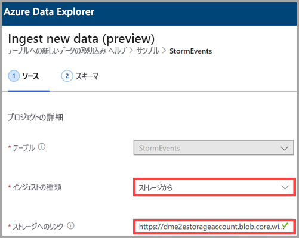
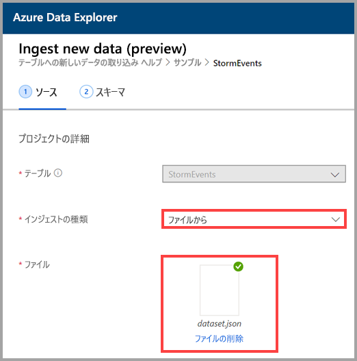
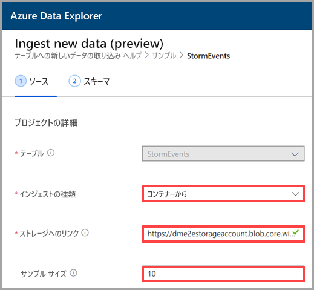
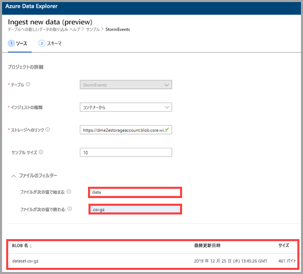

## インジェストの種類を選択する

**[Ingestion type]\(インジェストの種類\)** には、次のいずれかのオプションを選択します。
   * **ストレージから** - **[Link to storage]\(ストレージにリンク\)** フィールドに、ストレージ アカウントの URL を追加します。 プライベート ストレージ アカウントには [BLOB SAS URL](/azurevs-azure-tools-storage-explorer-blobs#get-the-sas-for-a-blob-container) を使用します。
   
      

    * **ファイルから** - **[Browse]\(参照\)** を選択してファイルを見つけるか、ファイルをフィールドにドラッグします。
  
      

    * **コンテナーから** - **[Link to storage]\(ストレージにリンク\)** フィールドにコンテナーの [SAS URL](/azure/vs-azure-tools-storage-explorer-blobs#get-the-sas-for-a-blob-container) を追加し、必要に応じてサンプル サイズを入力します。

      

  データのサンプルが表示されます。 必要に応じて、特定の文字で始まる、または終わるファイルだけを表示するようにフィルター処理することができます。 フィルターを調整すると、プレビューが自動的に更新されます。
  
  たとえば、*data* という単語で始まり、 *.csv.gz* 拡張子で終わるすべてのファイルを表示するようにフィルター処理できます。

  
