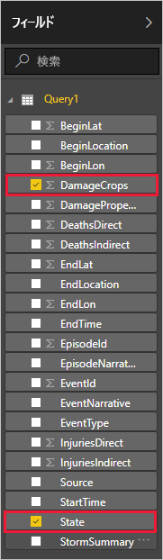

Power BI Desktop にデータを取り込んだら、そのデータに基づいてレポートを作成することができます。 州ごとの作物の被害を示す縦棒グラフを使った単純なレポートを作成します。

1. メイン Power BI ウィンドウの左側で、レポート ビューを選択します。

    

1. **[視覚化]** ウィンドウで、集合縦棒グラフを選択します。

    

    空のグラフがキャンバスに追加されます。

    

1. **[フィールド]** の一覧で、**DamageCrops** と **State** を選択します。

    

    作物への被害を示すグラフが完成しました。このグラフは、テーブル内の上位 1,000 行を対象としています。

    

1. レポートを保存します。