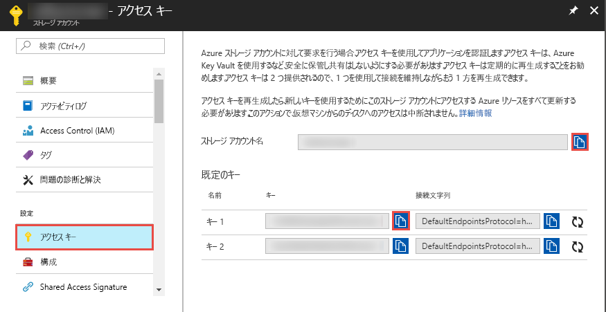

## <a name="prerequisites"></a>前提条件

### <a name="azure-subscription"></a>Azure サブスクリプション
Azure サブスクリプションをお持ちでない場合は、開始する前に [無料アカウント](https://azure.microsoft.com/free/) を作成してください。

### <a name="azure-roles"></a>Azure ロール
Data Factory インスタンスを作成するには、Azure へのサインインに使用するユーザー アカウントが、"*共同作成者*" ロールまたは "*所有者*" ロールのメンバーであるか、Azure サブスクリプションの "*管理者*" である必要があります。 Azure Portal で右上隅にあるユーザー名を選択し、**[アクセス許可]** を選択して、サブスクリプションで自分が持っているアクセス許可を表示します。 複数のサブスクリプションにアクセスできる場合は、適切なサブスクリプションを選択します。 ロールにユーザーを追加するサンプル手順については、[ロールの追加](../articles/billing/billing-add-change-azure-subscription-administrator.md)に関する記事を参照してください。

### <a name="azure-storage-account"></a>Azure ストレージ アカウント
このクイックスタートでは、"*ソース*" データ ストアと "*コピー先*" データ ストアの両方に汎用の Azure ストレージ アカウント (具体的には BLOB ストレージ) を使用します。 汎用の Azure ストレージ アカウントがない場合、作成方法については、「[ストレージ アカウントの作成](../articles/storage/common/storage-create-storage-account.md#create-a-storage-account)」を参照してください。 

#### <a name="get-the-storage-account-name-and-account-key"></a>ストレージ アカウント名とアカウント キーの取得
このクイックスタートでは、Azure Storage アカウントの名前とキーを使用します。 以下の手順に従って、ご利用のストレージ アカウントの名前とキーを取得してください。 

1. Web ブラウザーで、[Azure Portal](https://portal.azure.com) に移動します。 Azure のユーザー名とパスワードを使用してサインインします。 
2. 左側のメニューの **[その他のサービス]** を選択し、"**ストレージ**" というキーワードでフィルター処理して、**[ストレージ アカウント]** を選択します。

   
3. ストレージ アカウントの一覧で、ご利用のストレージ アカウントを (必要に応じて) フィルターで抽出し、該当するストレージ アカウントを選択します。 
4. **[ストレージ アカウント]** ページのメニューで **[アクセス キー]** を選択します。

   
5. **[ストレージ アカウント名]** ボックスと **[Key1]** ボックスの値をクリップボードにコピーします。 それらをメモ帳または他のエディターに貼り付けて保存します。 このクイックスタートの後の方で使用します。   

#### <a name="create-the-input-folder-and-files"></a>入力フォルダーとファイルの作成
このセクションでは、**adftutorial** という名前の BLOB コンテナーを Azure Blob Storage に作成します。 そのコンテナーに **input** という名前のフォルダーを作成し、input フォルダーにサンプル ファイルをアップロードします。 

1. **[ストレージ アカウント]** ページで **[概要]** に切り替え、**[BLOB]** を選択します。 

   
2. **[Blob service]** ページのツール バーで、**[+ コンテナー]** を選択します。 

       
3. **[新しいコンテナー]** ダイアログ ボックスで、名前に「**adftutorial**」と入力し、**[OK]** を選択します。 

   
4. コンテナーの一覧で **[adftutorial]** を選択します。 

   
1. **[コンテナー]** ページのツール バーで、**[アップロード]** を選択します。  

   ![[アップロード] ボタン](media/data-factory-quickstart-prerequisites/upload-toolbar-button.png)
6. **[BLOB のアップロード]** ページで、**[詳細設定]** を選択します。

   ![[詳細設定] リンクの選択](media/data-factory-quickstart-prerequisites/upload-blob-advanced.png)
7. **メモ帳**を起動し、**emp.txt** という名前のファイルを作成して次の内容を入力します。 それを **c:\ADFv2QuickStartPSH** フォルダーに保存します。 まだ存在しない場合、**ADFv2QuickStartPSH** フォルダーを作成します。
    
   ```
   John, Doe
   Jane, Doe
   ```    
8. Azure Portal の **[BLOB のアップロード]** ページの **[ファイル]** ボックスで、**emp.txt** ファイルを探して選択します。 
9. **[アップロード先のフォルダー]** ボックスの値として、「**input**」と入力します。 

        
10. フォルダーが **input** で、ファイルが **emp.txt** であることを確認し、**[アップロード]** を選択します。
    
    一覧に **emp.txt** ファイルとアップロードの状態が表示されます。 
12. 隅の **[X]** をクリックして、**[BLOB のアップロード]** ページを閉じます。 

    
1. **[コンテナー]** ページを開いたままにしておきます。 このクイックスタートの最後で、このページを使用して出力を確認します。