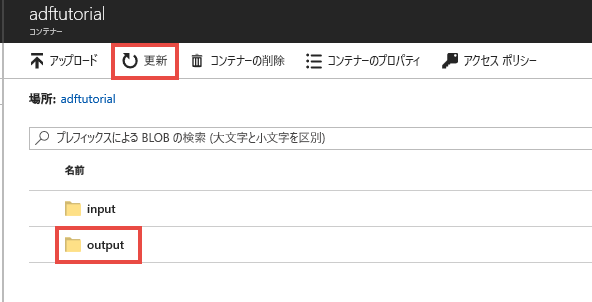
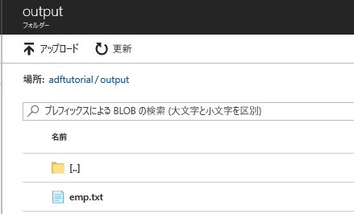

## <a name="verify-the-output"></a>出力を検証する
このパイプラインは、adftutorial BLOB コンテナーに対して output フォルダーを自動的に作成します。 そのうえで、input フォルダーから output フォルダーに emp.txt ファイルをコピーします。 

1. Azure Portal の **adftutorial** コンテナー ページで **[最新の情報に更新]** をクリックして出力フォルダーを表示します。 
    
    
2. フォルダー一覧の **[output]** をクリックします。 
2. **emp.txt** が output フォルダーにコピーされていることを確認します。 

    

## <a name="clean-up-resources"></a>リソースをクリーンアップする
このクイックスタートで作成したリソースは、2 とおりの方法でクリーンアップすることができます。 [Azure リソース グループ](../articles/azure-resource-manager/management/overview.md)を削除した場合、そのリソース グループに含まれたすべてのリソースが対象となります。 他のリソースをそのまま維持する場合は、このチュートリアルで作成したデータ ファクトリだけを削除してください。

リソース グループを削除すると、その中のデータ ファクトリも含めて、すべてのリソースが削除されます。 次のコマンドを実行して、リソース グループ全体を削除します。 
```powershell
Remove-AzResourceGroup -ResourceGroupName $resourcegroupname
```

リソース グループの削除には、しばらく時間がかかることがあります。 処理が完了するまでお待ちください。

リソース グループ全体ではなく、データ ファクトリだけを削除する場合は、次のコマンドを実行します。 

```powershell
Remove-AzDataFactoryV2 -Name $dataFactoryName -ResourceGroupName $resourceGroupName
```