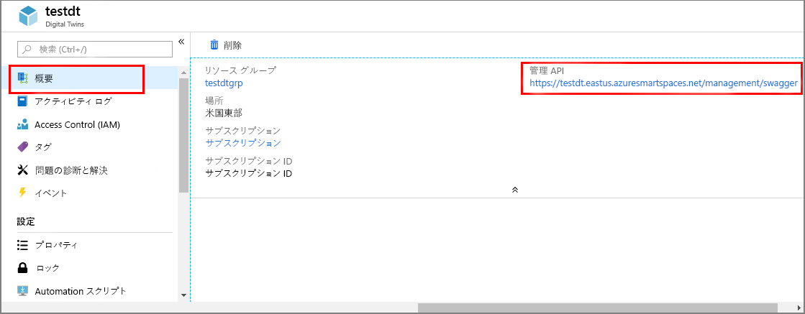

1. [Azure Portal](https://portal.azure.com) にサインインします。

1. 左側のウィンドウで、 **[リソースの作成]** を選択します。 **digital twins** を検索し、 **[Digital Twins]** を選択します。 **[作成]** を選択してデプロイ プロセスを開始します。

   

1. **[Digital Twins]** ウィンドウで、次の情報を入力します。
   * **[リソース名]** :Digital Twins インスタンスの一意の名前を作成します。
   * **サブスクリプション**:この Digital Twins インスタンスを作成するために使用するサブスクリプションを選択します。 
   * **[リソース グループ]** :Digital Twins インスタンスの[リソース グループ](https://docs.microsoft.com/azure/azure-resource-manager/resource-group-overview#resource-groups)を選択または作成します。
   * **[場所]** :使用しているデバイスに最も近い場所を選択します。

     ![情報が入力されている [Digital Twins] ウィンドウ](./media/create-digital-twins-portal/create-digital-twins-param.png)

1. Digital Twins の情報を確認してから、 **[作成]** を選択します。 Digital Twins インスタンスが作成されるまでに数分かかる場合があります。 **[通知]** ウィンドウで進行状況を監視できます。

1. Digital Twins インスタンスの **[概要]** ウィンドウを開きます。 **[管理 API]** の下のリンクに注目します。

   **[管理 API]** の URL は、`https://yourDigitalTwinsName.yourLocation.azuresmartspaces.net/management/swagger` という形式です。 この URL では、インスタンスに適用される Azure Digital Twins REST API のドキュメントが表示されます。 この API ドキュメントを読んで使用する方法については、「[How to use Azure Digital Twins Swagger (Azure Digital Twins Swagger の使用方法)](../articles/digital-twins/how-to-use-swagger.md)」を参照してください。

    **[管理 API]** の URL を `https://yourDigitalTwinsName.yourLocation.azuresmartspaces.net/management/api/v1.0/` という形式に変更します。 アプリケーションは、変更された URL をベース URL として使用してインスタンスにアクセスします。 この変更した URL を一時ファイルにコピーします。 これは次のセクションで必要になります。

    