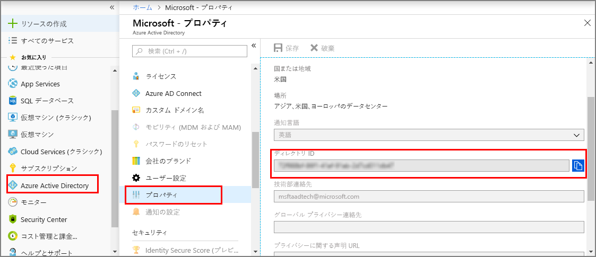

1. [Azure portal](https://portal.azure.com) で、左側のウィンドウの **[Azure Active Directory]** を開き、**[プロパティ]** ウィンドウを開きます。 **ディレクトリ ID** を一時ファイルにコピーします。 この値は、次のセクションでサンプル アプリケーションを構成する際に使用します。

    

1. **[アプリの登録]** ウィンドウを開き、**[新しいアプリケーションの登録]** ボタンを選択します。

    ![[アプリの登録] ウィンドウ](./media/digital-twins-permissions/aad-app-reg-start.png)

1. **[名前]** ボックスに、このアプリ登録の表示名を入力します。 **[アプリケーションの種類]** で **[ネイティブ]** を選択し、**[リダイレクト URI]** で `https://microsoft.com` を選択します。 **作成**を選択します。

    ![[作成] ウィンドウ](./media/digital-twins-permissions/aad-app-reg-create.png)

1. 登録されたアプリを開き、**[アプリケーション ID]** フィールドの値を一時ファイルにコピーします。 この値により、Azure Active Directory アプリが識別されます。 アプリケーション ID は、次のセクションでサンプル アプリケーションを構成する際に使用します。

    

1. アプリ登録ウィンドウを開きます。 **[設定]** > **[必要なアクセス許可]** の順に選択します。その後、次の操作を行います。

   a. 左上にある **[追加]** を選択して、**[API アクセスの追加]** ウィンドウを開きます。

   b. **[API を選択します]** を選択し、**Azure Digital Twins** を検索します。 検索で API が見つからない場合は、代わりに **Azure Smart Spaces** を検索します。

   c. **[Azure Digital Twins (Azure Smart Spaces Service)]** オプションを選択し、**[選択]** を選択します。

   d. **[アクセス許可の選択]** を選択します。 **[読み取り/書き込みアクセス]** の委任されたアクセス許可チェック ボックスをオンにし、**[選択]** を選択します。

   e. **[API アクセスの追加]** ウィンドウで、**[完了]** を選択します。

   f. **[必要なアクセス許可]** ウィンドウで、**[アクセス許可の付与]** ボタンを選択し、表示される確認メッセージに同意します。

      ![[必要なアクセス許可] ウィンドウ](./media/digital-twins-permissions/aad-app-req-permissions.png)
