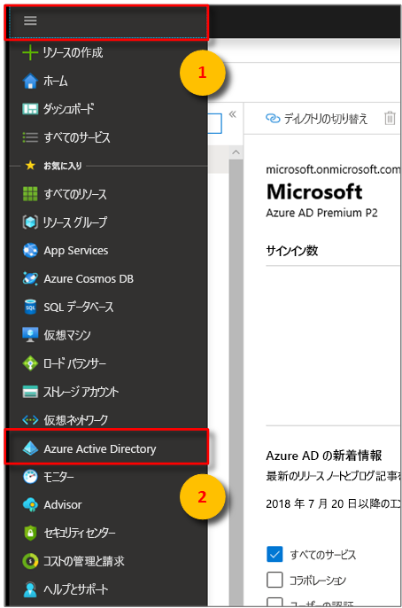

>[!NOTE]
>このセクションでは、[Azure AD アプリの登録](https://docs.microsoft.com/azure/active-directory/develop/quickstart-register-app)手順について説明します。

1. [Azure portal](https://portal.azure.com) で、展開可能な左側のメニューの **[Azure Active Directory]** を開き、 **[アプリの登録]** ペインを開きます。 

    

1. **[+ 新規登録]** ボタンを選択します。

    

1. **[名前]** ボックスに、このアプリ登録の表示名を入力します。 **[リダイレクト URI (省略可能)]** セクションで、左側のドロップダウン メニューから **[パブリック クライアント/ネイティブ (モバイルとデスクトップ)]** を選択し、右側のテキストボックスに「`https://microsoft.com`」と入力します。 **[登録]** を選択します。

    

1. [アプリが "**パブリック クライアント**" として登録されている](https://docs.microsoft.com/azure/active-directory/develop/scenario-desktop-app-registration)ことを確認するには、アプリ登録の **[認証]** ペインを開き、そのペインを下にスクロールします。 **[既定のクライアントの種類]** セクションで、 **[アプリケーションは、パブリック クライアントとして扱います]** に **[はい]** を選択し、 **[保存]** をクリックします。

    **アクセス トークン** を確認して、Manifest.json の **oauth2AllowImplicitFlow** 設定を有効にします。

    

1.  登録済みアプリの **[概要]** ペインを開き、次のエンティティの値を一時ファイルにコピーします。 これらの値は、以下のセクションでサンプル アプリケーションを構成する際に使用します。

    - **アプリケーション (クライアント) ID**
    - **ディレクトリ (テナント) ID**

    

1. アプリの登録の **[API アクセス許可]** ウィンドウを開きます。 **[+ アクセス許可の追加]** ボタンを選択します。 **[API アクセス許可の要求]** ペインで、 **[所属する組織で使用している API]** タブを選択し、次のいずれかを選択します。
    
    1. `Azure Digital Twins` **Azure Digital Twins** API を選択します。

        

    1. または、`Azure Smart Spaces Service` を検索します。 **Azure Smart Spaces Service** API を選択します。

        

    > [!IMPORTANT]
    > 表示される Azure AD API の名前と ID は、テナントによって異なります。
    > * テスト テナントと顧客アカウントでは、`Azure Digital Twins` を検索する必要があります。
    > * 他の Microsoft アカウントでは、`Azure Smart Spaces Service` を検索する必要があります。

1. 選択されたいずれかの API は、同じ **[API アクセス許可の要求]** ペインに **Azure Digital Twins** と表示されます。 **[Read]\(読み取り\)** ドロップ ダウンを選択し、 **[Read.Write]** チェック ボックスをオンにします。 **[アクセス許可の追加]** ボタンを選択します

    

1. 組織の設定によっては、この API への管理者アクセスを許可するために追加の手順を実行する必要があります。 詳細については、管理者にお問い合わせください。 管理者アクセスが承認されると、 **[API アクセス許可]** ペインの **[管理者の同意が必要]** 列にアクセス許可が表示されます。 

    

    **Azure Digital Twins** が表示されていることを確認します。
