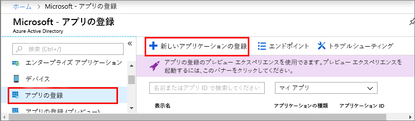

1. [Azure portal](https://portal.azure.com) で、左側のナビゲーション ウィンドウから **[Azure Active Directory]** を開き、**[プロパティ]** ウィンドウを開きます。 **ディレクトリ ID** を一時ファイルにコピーします。 この値は、次のセクションでサンプル アプリケーションを構成する際に使用します。

    

1. **[アプリの登録]** ウィンドウを開き、**[新しいアプリケーションの登録]** ボタンをクリックします。
    
    

1. **[名前]** フィールドに、このアプリ登録の表示名を入力します。 **[アプリケーションの種類]** で **_[ネイティブ]_** を、**[リダイレクト URI]** で **_https://microsoft.com_** を選択します。 **Create** をクリックしてください。

    

1. 登録されたアプリを開き、**[アプリケーション ID]** フィールドの値を一時ファイルにコピーします。この値により、Azure Active Directory アプリが識別されます。 アプリケーション ID は、次のセクションでサンプル アプリケーションを構成する際に使用します。

    

1. アプリ登録ウィンドウを開き、**[設定]** > **[必要なアクセス許可]** の順にクリックします。
    - 左上にある **[追加]** をクリックして、**[API アクセスの追加]** ウィンドウを開きます。
    - **[API を選択します]** をクリックし、**Azure Digital Twins** を検索します。 検索で API が見つからない場合は、代わりに **Azure Smart Spaces** を検索します。
    - **[Azure Digital Twins (Azure Smart Spaces Service)]** オプションを選択し、**[選択]** をクリックします。
    - **[アクセス許可の選択]** をクリックします。 **[読み取り/書き込みアクセス]** の委任されたアクセス許可チェック ボックスをオンにし、**[選択]** をクリックします。
    - **[API アクセスの追加]** ウィンドウで、**[完了]** をクリックします。
    - **[必要なアクセス許可]** ウィンドウで、**[アクセス許可の付与]** ボタンをクリックし、表示された確認メッセージに同意します。

       
