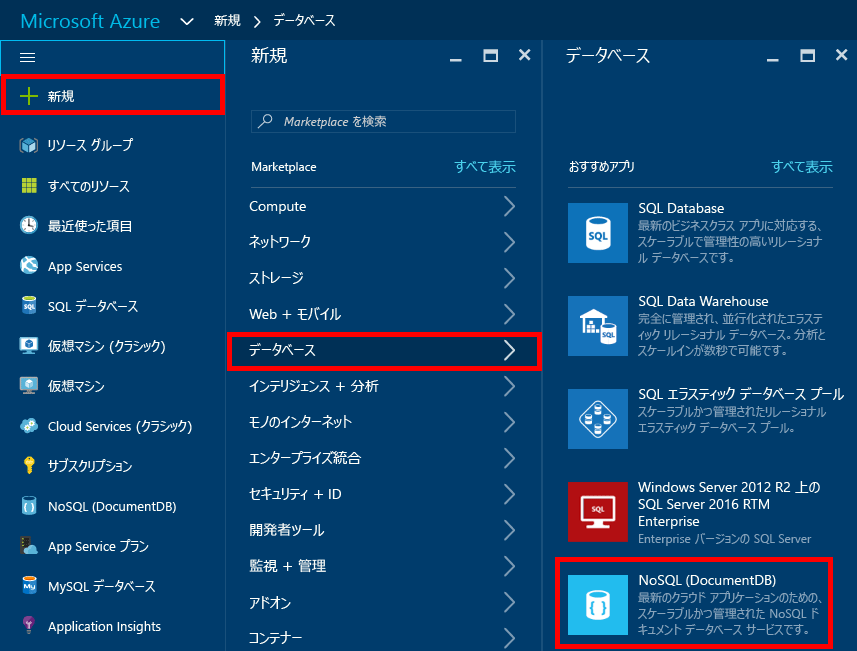
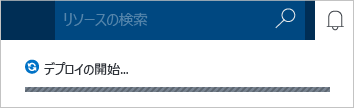
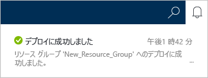
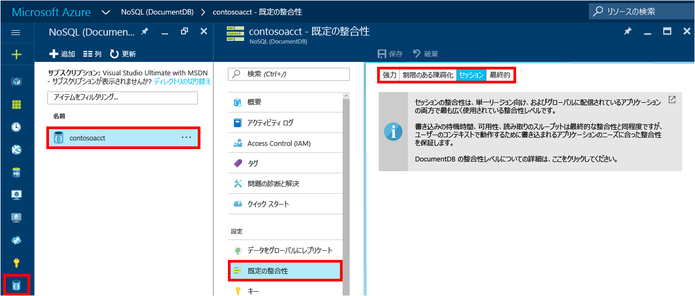

1. 新しいウィンドウで、[Azure Portal](https://portal.azure.com/) にサインインします。
2. ジャンプバーで **[新規]**、**[データベース]**、**[NoSQL (DocumentDB)]** の順にクリックします。
   
     
3. **[新しいアカウント]** ブレードで、DocumentDB アカウントに必要な構成を指定します。
   
    ![新しい [DocumentDB] ブレードのスクリーンショット](./media/documentdb-create-dbaccount/create-nosql-db-databases-json-tutorial-2.png)
   
   * **[ID]** ボックスに、DocumentDB アカウントを識別する名前を入力します。  **ID** が検証されると、緑色のチェック マークが **[ID]** ボックスに表示されます。 この **ID** の値は、URI 内のホスト名になります。 **ID** に含めることができるのは英小文字、数字、および "-" のみで、文字数は 3 ～ 50 文字にする必要があります。 選択したエンドポイント名に *documents.azure.com* が追加され、これが DocumentDB アカウント エンドポイントになります。
   * **[NoSQL API]** ボックスで、**[DocumentDB]** を選択します。  
   * **[サブスクリプション]**で、DocumentDB アカウントに使用する Azure サブスクリプションを選択します。 アカウントにサブスクリプションが 1 つしかない場合は、そのアカウントが既定で選択されます。
   * **[リソース グループ]**で、DocumentDB アカウントのリソース グループを選択または作成します。  既定では、新しいリソース グループが作成されます。 詳細については、 [Azure Portal を使用した Azure リソースの管理](../articles/azure-portal/resource-group-portal.md)に関する記事をご覧ください。
   * **[場所]** を使用して、DocumentDB アカウントをホストする地理的な場所を指定します。 
4. 新しい DocumentDB アカウントのオプションを構成したら、 **[作成]**をクリックします。 デプロイの状態を通知ハブで確認します。  
   
     
   
   
5. DocumentDB アカウントが作成されたら、既定の設定で使用できる状態になります。 既定の設定を確認するには、ジャンプバーの **[NoSQL (DocumentDB)]** アイコンをクリックし、新しいアカウントをクリックして、リソース メニューの **[既定の整合性]** をクリックします。

     

   DocumentDB アカウントの既定の整合性は **[セッション]**に設定されます。  既定の整合性を調整するには、使用可能なその他の整合性オプションのいずれかを選択します。 DocumentDB によって提供される整合性レベルの詳細については、「 [DocumentDB の整合性レベル](../articles/documentdb/documentdb-consistency-levels.md)」をご覧ください。

[How to: Create a DocumentDB account]: #Howto
[Next steps]: #NextSteps
[documentdb-manage]:../articles/documentdb/documentdb-manage.md
