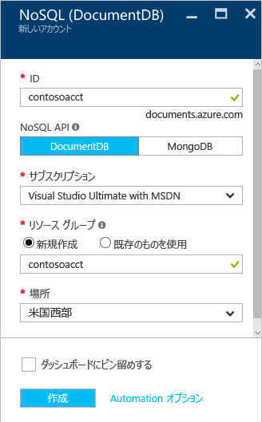

1. 新しいウィンドウで、[Azure Portal](https://portal.azure.com/) にサインインします。
2. 左側のメニューで、**[新規]**、**[データベース]**、**[Azure Cosmos DB]** の順にクリックします。
   
   

3. **[新しいアカウント]** ブレードで、Azure Cosmos DB アカウントに必要な構成を指定します。 

    Azure Cosmos DB では、Gremlin (グラフ)、MongoDB、SQL (DocumentDB)、および Table (キー値) の 4 つのプログラミング モデルのいずれかを選択できます。 
    
    このクイック スタートでは、DocumentDB API に対してプログラミングするため、フォームに入力するときに **SQL (DocumentDB)** を選択します。 ただし、ソーシャル メディア アプリ用のグラフ データ、キー/値 (テーブル) データ、または MongoDB アプリから移行されたデータがある場合は、Azure Cosmos DB が、ミッション クリティカルなすべてのアプリケーションのための可用性の高い、世界中に分散したデータベース サービス プラットフォームを提供できることを認識してください。

    ガイドとしてスクリーンショットの情報を使用して、新しいアカウント ブレードに記入します。 自分のアカウントを設定したときに一意の値を選択するので、値はスクリーンショットには正確には一致しません。 
 
    

    設定|推奨値|説明
    ---|---|---
    ID|*一意の値*|Azure Cosmos DB アカウントを識別するために選択する一意の名前。 指定した ID に *documents.azure.com* が付加されて URI が作成されるので、ID は一意であっても識別可能なものを使用してください。 ID には小文字、数字、'-' 文字のみを含めることができ、文字数は 3 ～ 50 文字にする必要があります。
    API|SQL (DocumentDB)|この記事の後半で、[DocumentDB API](../articles/documentdb/documentdb-introduction.md) に対してプログラミングします。|
    サブスクリプション|*該当するサブスクリプション*|Azure Cosmos DB アカウントに使用する Azure サブスクリプション。 
    リソース グループ|*ID と同じ値*|自分のアカウントの新しいリソース グループの名前。 簡略化のため、ID と同じ名前を使用することができます。 
    場所|*ユーザーに最も近いリージョン*|Azure Cosmos DB アカウントをホストする地理的な場所です。 データに最も高速にアクセスできる、ユーザーに最も近い場所を選択します。
4. **[作成]** をクリックしてアカウントを作成します。
5. 上部のツール バーの **[通知]** をクリックして、デプロイ プロセスを監視します。

    

6.  デプロイが完了したら、[All Resources] (すべてのリソース) タイルから、新しいアカウントを開きます。 

    ![[All Resources] (すべてのリソース) タイルの DocumentDB アカウント](./media/documentdb-create-dbaccount/azure-documentdb-all-resources.png)