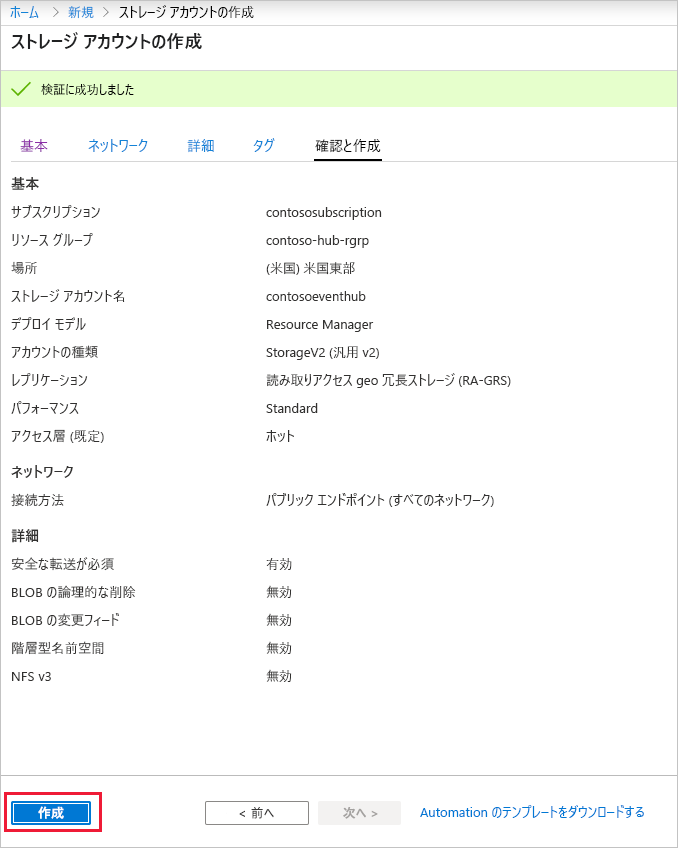
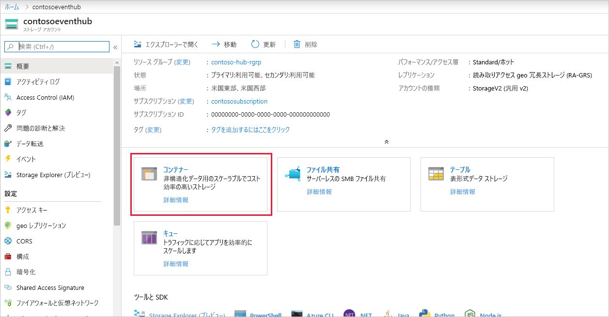
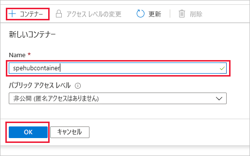

### イベント プロセッサ ホストのストレージ アカウントの作成
イベント プロセッサ ホストは、永続的なチェックポイントの管理によって Event Hubs のイベントの受信を簡素化し、並列して受信を行うインテリジェントなエージェントです。 チェックポイント処理を実行するために、イベント プロセッサ ホストではストレージ アカウントが必要です。 次の例は、ストレージ アカウントを作成する方法とそのアクセス キーを取得する方法を示します。

1. Azure portal メニューから **[リソースの作成]** を選択します。

    ![[リソースの作成] メニュー項目、Microsoft Azure portal](./media/event-hubs-create-storage/create-resource.png)

2. **[ストレージ]**  >  **[ストレージ アカウント]** を選択します。
   
    ![[ストレージ アカウント] を選択する、Microsoft Azure portal](./media/event-hubs-create-storage/select-storage-account.png)

3. **[ストレージ アカウントの作成]** ページで、次の手順を実行します。 

   1. **ストレージ アカウント名**を入力します。
   2. イベント ハブが含まれている Azure **サブスクリプション**を選択します。
   3. イベント ハブが含まれている**リソース グループ**を選択または作成します。
   4. リソースを作成する**場所**を選択します。 
   5. **[Review + create]\(レビュー + 作成\)** を選択します。
   
        ![[確認と作成]、[ストレージ アカウントの作成]、Microsoft Azure portal](./media/event-hubs-create-storage/review-create.png)

4. **[確認および作成]** ページで値を確認し、 **[作成]** を選択します。 

    
5. 通知に "**デプロイメントが成功しました**" というメッセージが表示されたら、 **[リソースに移動]** を選択して [ストレージ アカウント] ページを開きます。 または、 **[デプロイの詳細]** を展開し、リソースの一覧から新しいリソースを選択することもできます。  

    ![[リソースに移動]、ストレージ アカウントのデプロイ、Microsoft Azure portal](./media/event-hubs-create-storage/go-to-resource.png) 
6. **[コンテナー]** を選択します。

    
7. 上部にある **[+ コンテナー]** を選択し、コンテナーの**名前**を入力して **[OK]** を選択します。 

    
8. **[ストレージ アカウント]** ページ メニューから **[アクセス キー]** を選択し、**key1** の値をコピーします。

    次の値をメモ帳などに一時的に保存します。
    - ストレージ アカウントの名前
    - ストレージ アカウントのアクセス キー
    - コンテナーの名前
