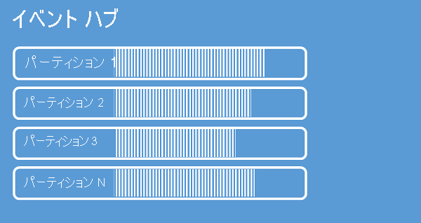

Event Hubs は、パーティション化されたコンシューマー パターンを使用してメッセージ ストリーミングを実現します。このパターンでは、各コンシューマーはメッセージ ストリームの特定のサブセット (またはパーティション) のみを読み取ります。 このパターンでは、イベント処理能力を水平方向に拡張 (スケールアウト) することができ、キューおよびトピックでは利用できない、ストリームに重点を置いたその他の機能が利用できます。

パーティションは、イベント ハブで保持される順序付けされた一連のイベントです。 新しいイベントが到着すると、このシーケンスの末尾に追加されます。 パーティションは "コミット ログ" として考えることができます。

Event Hubs は構成されたリテンション期間にわたりデータを保持します。この期間は、イベント ハブのすべてのパーティションに適用されます。 イベントの有効期限は時間で設定されます。イベントを明示的に削除することはできません。 パーティションは独立していて、それぞれ独自のデータ シーケンスを含んでいるため、多くの場合、拡大するペースは異なります。

パーティションの数は作成時に 2 ～ 32 の間で指定する必要があります。 パーティションの数は変更できないため、設定については長期的な規模で検討する必要があります。 パーティションはデータ編成メカニズムであり、コンシューマー アプリケーションで必要とされるダウンストリーム並列処理に関連します。 イベント ハブでのパーティションの数は、予想される同時接続のリーダー数に直接関連します。 Event Hubs チームに連絡すれば、パーティションの数を 32 より大きくすることができます。

作成時点では、選択可能な最大値 (32) に設定しておくとよいでしょう。 複数のパーティションがある場合、イベントは、その順序を維持せずに、複数のパーティションに送信されることに注意してください (ただし、32 個中 1 つのパーティションにのみ送信し、残りの 31 個を冗長パーティションとするように送信側を構成した場合を除く)。 前者の場合、32 個の全パーティションにまたがってイベントを読み取る必要があります。 後者の場合は、イベント プロセッサ ホストで行うべき構成が増えること以外、特別な追加コストは発生しません。

パーティションは識別可能であり、パーティションに直接送信できますが、パーティションに直接送信することはお勧めしません。 その代わり、「[イベント発行元](../articles/event-hubs/event-hubs-features.md#event-publishers)」のセクションで紹介する、より高いレベルの構造を使用できます。 

パーティションには一連のイベント データが格納されます。イベント データには、イベント本文、ユーザー定義のプロパティ バッグ、メタデータ (パーティションでのオフセットやストリーム シーケンスでの番号など) が含まれます。

最適なスケールを実現するために、スループット ユニットとパーティションのバランスを 1:1 に保つことをお勧めします。 単一のパーティションには、最大で 1 つのスループット ユニットのイングレスとエグレスが保証されます。 パーティションでより高いスループットを実現することもできますが、パフォーマンスは保証されません。 このため、イベント ハブのパーティションの数は、スループット ユニットの数以上にすることを強くお勧めします。

合計スループットを必要に応じて計画するとして、必要なスループット ユニットの数と最小数のパーティションはわかりますが、パーティションはいくつ必要でしょうか。 実現したいダウンストリーム並列処理だけでなく、将来のスループットのニーズに基づいて、パーティションの数を選択します。 Event Hubs 内にあるパーティションの数に対して料金はかかりません。

パーティションの詳細および可用性と信頼性のトレードオフについては、「[Event Hubs のプログラミング ガイド](../articles/event-hubs/event-hubs-programming-guide.md#partition-key)」と「[Event Hubs における可用性と一貫性](../articles/event-hubs/event-hubs-availability-and-consistency.md)」をご覧ください。
