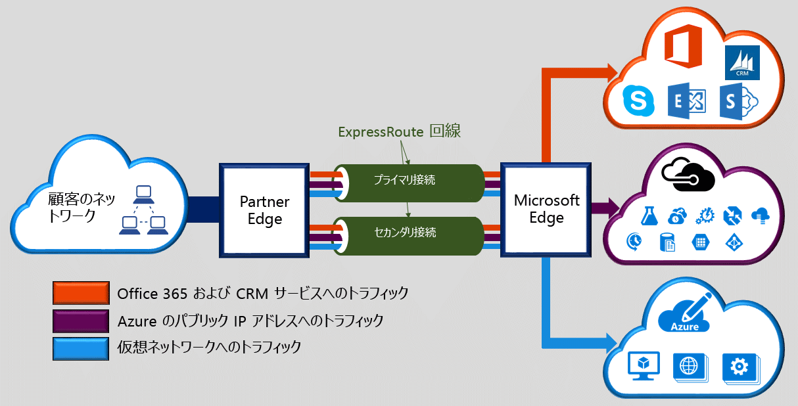

Microsoft Azure ExpressRoute を利用すれば、接続プロバイダーが提供する専用プライベート接続で、オンプレミスのネットワークを Microsoft クラウドに拡張できます。 ExpressRoute では、Microsoft Azure、Office 365、CRM Online などの Microsoft クラウド サービスへの接続を確立できます。 接続には、任意の環境間 (IP VPN) 接続、ポイントツーポイントのイーサネット接続、共有施設での接続プロバイダーによる仮想交差接続があります。 ExpressRoute 接続では、公共のインターネットを利用できません。 それにより、ExpressRoute 接続はインターネット経由の一般的な接続に比べて、安全性と信頼性が高く、待機時間も短く、高速です。  

<!--HONumber=Jan17_HO1-->

