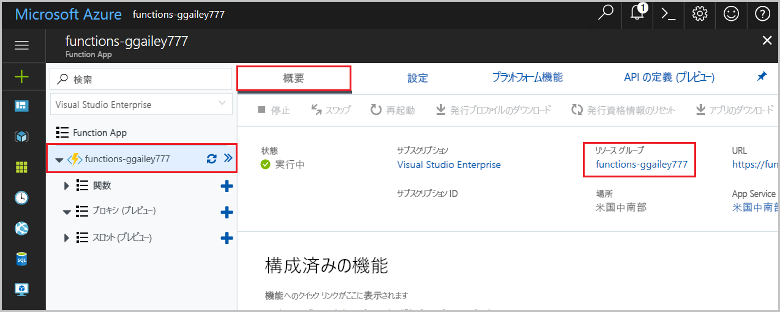

1. Visual Studio Code で、F1 キーを押してコマンド パレットを開きます。 コマンド パレットで、`Azure Functions: Open in portal` を検索して選択します。

1. 関数アプリを選択し、Enter キーを押します。 その関数アプリのページが Azure portal で開きます。

1. **[概要]** タブの **[リソース グループ]** で名前付きリンクを選択します。

    

1. **[リソース グループ]** ページで、含まれているリソースの一覧を確認し、削除するものであることを確認します。
 
1. **[リソース グループの削除]** を選択し、指示に従います。

   削除には数分かかることがあります。 実行されると、通知が数秒間表示されます。 ページの上部にあるベルのアイコンを選択して、通知を表示することもできます。
