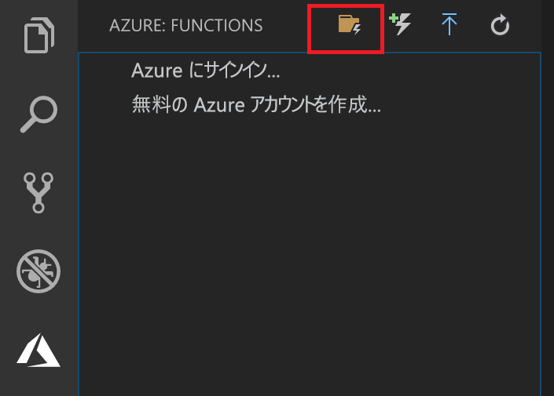
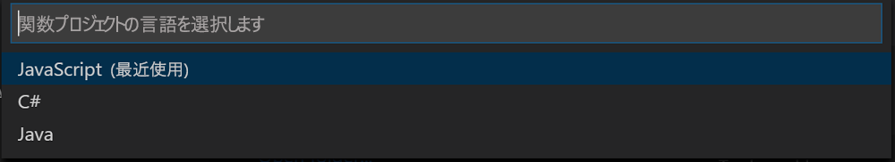

## Azure Functions プロジェクトを作成する

Visual Studio Code の Azure Functions プロジェクト テンプレートでは、Azure の関数アプリに発行できるプロジェクトを作成します。 関数アプリを使用すると、リソースを管理、デプロイ、および共有するための論理ユニットとして関数をグループ化できます。

1. Visual Studio Code で、Azure ロゴを選択して **[Azure: Functions]** 領域を表示し、[新しいプロジェクトの作成] アイコンを選択します。

    

1. プロジェクト ワークスペースの場所を選択し、**[選択]** をクリックします。

    > [!NOTE]
    > この記事は、ワークスペースの外部で実行するように設計されています。 ここでは、ワークスペースに含まれるプロジェクト フォルダーは選択しないでください。

1. 関数アプリ プロジェクトの言語を選択します。 この記事では、JavaScript を使用しています。
    

1. メッセージが表示されたら、**[Add to workspace]\(ワークスペースに追加\)** を選択します。

Visual Studio Code によって、新しいワークスペースに関数アプリ プロジェクトが作成されます。 このプロジェクトには、[host.json](../articles/azure-functions/functions-host-json.md) および [local.settings.json](../articles/azure-functions/functions-run-local.md#local-settings-file) 構成ファイルと、言語固有のプロジェクト ファイルが含まれています。 プロジェクト フォルダーに新しい Git リポジトリも取得します。