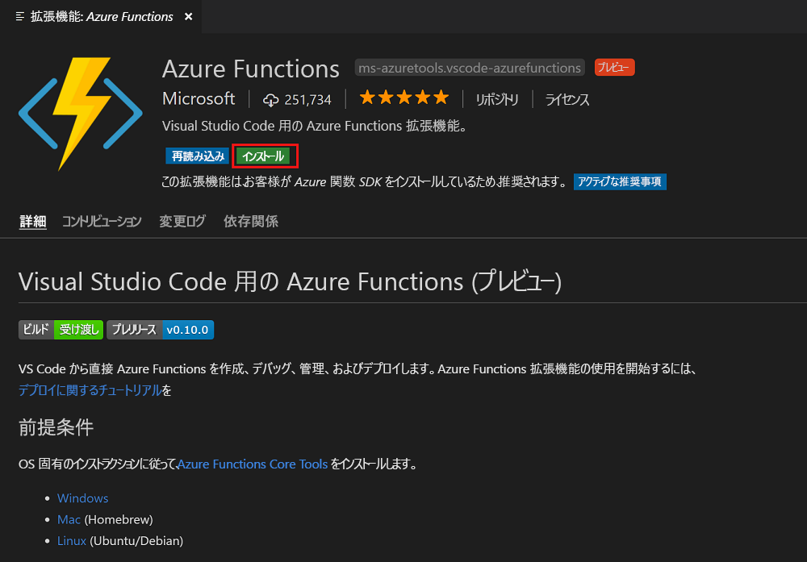
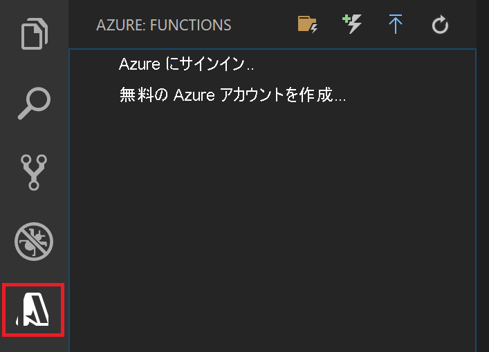

## Azure Functions 拡張機能をインストールする

Azure Functions 拡張機能を使用すると、関数を作成してテストし、Azure にデプロイすることができます。

1. Visual Studio Code で **[拡張機能]** を開き、**azure functions** を検索するか、[Visual Studio Code でこのリンクを選択](vscode:extension/ms-azuretools.vscode-azurefunctions)します。

1. **[インストール]** を選択して、Visual Studio Code に拡張機能をインストールします。

    

1. インストール後、アクティビティ バーの Azure アイコンを選択します。 サイド バーに Azure Functions 領域が表示されます。

    