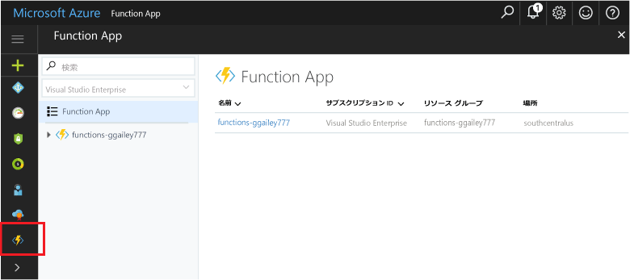

## Portal のお気に入りの関数 

Function App をまだ Azure Portal のお気に入りに追加していない場合は、追加します。 これにより、Function App が探しやすくなります。 すでに追加した場合は、次のセクションに進みます。 

1. [Azure Portal](https://portal.azure.com/) にログインします。

2. 左下にある矢印をクリックしてすべてのサービスを展開して、**[Filter] \(フィルター)** フィールドに「`Functions`」と入力し、**[Function Apps] \(Function App)** の横にある星をクリックします。  
 
    

    これにより、ポータルの左側のメニューに [Functions] \(関数) アイコンが追加されます。

3. メニューを閉じ、最下部までスクロールして [Functions] \(関数) アイコンを表示します。 すべての Function App の一覧を表示するには、このアイコンをクリックします。 このアプリで関数を操作するには、Function App をクリックします。 
 
    
 
     