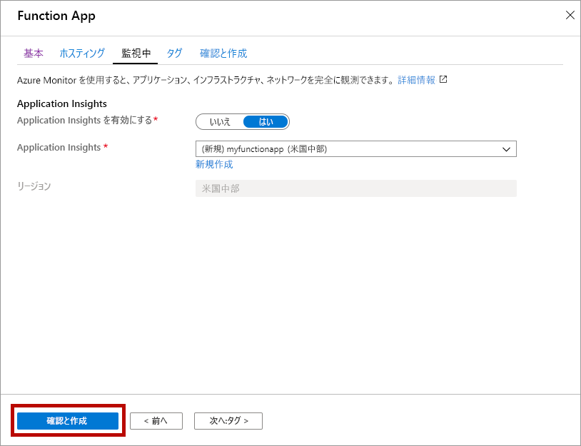

1. [https://portal.azure.com](https://portal.azure.com) から Azure portal を開きます

1. **[リソースの作成]** ボタンを選択します

    

1. **[Compute]**  >  **[Function App]** を選択します。

    

1. 図の下にある表に指定されている Function App の設定を使用します。

    

    | 設定      | 推奨値  | 説明 |
    | ------------ | ---------------- | ----------- |
    | **サブスクリプション** | 該当するサブスクリプション | この新しい Function App が作成されるサブスクリプション。 |
    | **[リソース グループ](../articles/azure-resource-manager/management/overview.md)** |  *myResourceGroup* | Function App を作成するための新しいリソース グループの名前。 |
    | **関数アプリ名** | グローバルに一意の名前 | 新しい Function App を識別する名前。 有効な文字は、`a-z` (大文字と小文字の区別をしない)、`0-9`、および `-`です。  |
    |**発行**| コード | コード ファイルまたは Docker コンテナーの発行オプション。 |
    | **ランタイム スタック** | 優先言語 | お気に入りの関数プログラミング言語をサポートするランタイムを選択します。 C# および F# 関数用の **[.NET]** を選択します。 |
    |**リージョン**| 優先リージョン | ユーザーに近い[リージョン](https://azure.microsoft.com/regions/)、または関数がアクセスする他のサービスの近くのリージョンを選択します。 |

    **[Next : Hosting >]\(次へ: ホスティング>\)** ボタンを選択します。

1. 次のホスト設定を入力します。

    

    | 設定      | 推奨値  | 説明 |
    | ------------ | ---------------- | ----------- |
    | **[ストレージ アカウント](../articles/storage/common/storage-account-create.md)** |  グローバルに一意の名前 |  Function App で使用されるストレージ アカウントを作成します。 ストレージ アカウント名の長さは 3 ～ 24 文字で、数字と小文字のみを使用できます。 既存のアカウントを使用することもできますが、[ストレージ アカウントの要件](../articles/azure-functions/functions-scale.md#storage-account-requirements)を満たしている必要があります。 |
    |**オペレーティング システム**| 優先オペレーティング システム | オペレーティング システムは、ランタイム スタックの選択に基づいてあらかじめ選択されますが、必要に応じて設定を変更できます。 |
    | **[プラン](../articles/azure-functions/functions-scale.md)** | Premium | [プランの種類] で、 **[Premium (プレビュー)]** を選択し、 *[Windows プラン]* と *[SKU とサイズ]* の選択項目の既定値を選択します。 |

    **[Next : Monitoring >]\(次へ: 監視>\)** ボタンを選択します。

1. 次の監視設定を入力します。

    

    | 設定      | 推奨値  | 説明 |
    | ------------ | ---------------- | ----------- |
    | **[Application Insights](../articles/azure-functions/functions-monitoring.md)** | Default | 最も近いサポートされているリージョン内に同じ*アプリ名*の Application Insights リソースを作成します。 この設定を展開することによって、 **[新しいリソース名]** を変更するか、またはデータを格納する [Azure 地理的環境](https://azure.microsoft.com/global-infrastructure/geographies/)内の別の **[場所]** を選択することができます。 |

    **[確認および作成]** を選択して、アプリ構成の選択内容を確認します。

1. **[作成]** を選択して、Function App をプロビジョニングし、デプロイします。