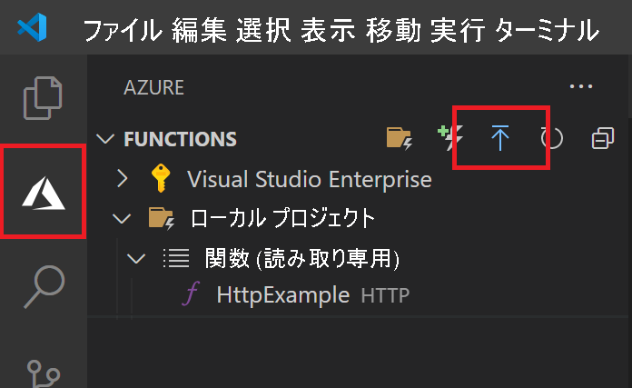
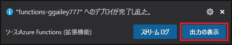

## Azure にプロジェクトを発行する

このセクションでは、ご利用の Azure サブスクリプションに関数アプリと関連リソースを作成し、コードをデプロイします。 

1. アクティビティ バーの Azure アイコンを選択し、 **[Azure: Functions]** 領域で、 **[Deploy to function app]\(関数アプリにデプロイ\)** ボタンを選択します。

    

1. プロンプトで、次の情報を入力します。

    + **Select subscription (サブスクリプションを選択してください)** : 使用するサブスクリプションを選択します。 サブスクリプションが 1 つのみの場合、このプロンプトは表示されません。

    + **Select function app in Azure (Azure で関数アプリを選択してください)** : (`Advanced` ではなく) `+ Create new Function App` を選択します。 この記事では、[高度な発行フロー](../articles/azure-functions/functions-develop-vs-code.md#enable-publishing-with-advanced-create-options)は取り上げません。 
    
    >[!IMPORTANT]
    > 既存の関数アプリに発行すると、Azure のそのアプリのコンテンツが上書きされます。 
    
    + **Enter a globally unique name for the function app (関数アプリのグローバルに一意の名前を入力します)** : URL パスに有効な名前を入力します。 入力した名前は、Azure Functions 内での一意性を確保するために検証されます。 
    
    ::: zone pivot="programming-language-python"
    + **Select a runtime (ランタイムを選択してください)** : ローカルで実行している Python のバージョンを選択します。 `python --version` コマンドを使用してバージョンを確認してください。
    ::: zone-end

    ::: zone pivot="programming-language-javascript,programming-language-typescript"
    + **Select a runtime (ランタイムを選択してください)** : ローカルで実行している Node.js のバージョンを選択します。 `node --version` コマンドを使用してバージョンを確認してください。
    ::: zone-end

    + **Select a location for new resources (新しいリソースの場所を選択してください)** : パフォーマンスを向上させるために、お近くの[リージョン](https://azure.microsoft.com/regions/)を選択してください。 
    
1.  完了すると、次の Azure リソースがサブスクリプションに作成されます。

    + **[リソース グループ](../articles/azure-resource-manager/management/overview.md)** :作成された Azure リソースがすべて含まれます。 名前は関数アプリの名前に基づきます。
    + **[ストレージ アカウント](../articles//storage/common/storage-introduction.md#types-of-storage-accounts)** :関数アプリの名前に基づいた一意の名前で、Standard Storage アカウントが作成されます。
    + **[ホスティング プラン](../articles/azure-functions/functions-scale.md)** :サーバーレス関数アプリをホストするために、従量課金プランが米国西部リージョンに作成されます。
    + **関数アプリ**:プロジェクトはこの新しい関数アプリにデプロイされ、そこで実行されます。
    + **Application Insights**:関数アプリに関連付けられたインスタンスが関数名に基づいて作成されます。

    関数アプリが作成され、展開パッケージが適用されると、通知が表示されます。 
    
1. この通知の **[View Output]\(出力の表示\)** を選択すると、作成済みの Azure リソースなど、作成とデプロイの結果が表示されます。 通知を見逃した場合は、右下隅にあるベル アイコンを選択して、再度確認します。

    
