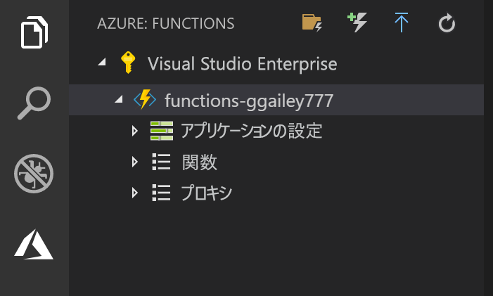

## Azure にプロジェクトを発行する

Visual Studio Code を使用すると、関数プロジェクトを Azure に直接発行できます。 このプロセスでは、Azure サブスクリプションに関数アプリと関連リソースを作成します。 関数アプリは、関数の実行コンテキストを提供します。 プロジェクトがパッケージ化され、Azure サブスクリプション内の新しい関数アプリにデプロイされます。 

この記事では、新しい関数アプリを作成することを想定しています。 既存の関数アプリに発行すると、Azure のそのアプリのコンテンツが上書きされます。

1. **[Azure: Functions]** 領域で、[Deploy to Function App]\(関数アプリにデプロイ\) アイコンを選択します。

    

1. 現在のワークスペースであるプロジェクト フォルダーを選択します。

1. 複数のサブスクリプションがある場合は、関数アプリをホストするサブスクリプションを選択し、**[+ Create New Function App]\(+ 新しい関数アプリの作成\)** を選択します。

1. 関数アプリを識別するグローバルに一意の名前を入力し、Enter キーを押します。 関数アプリ名の有効な文字は、`a-z`、`0-9`、`-` です。

1. **[+ 新しいリソース グループの作成]** を選択し、`myResourceGroup` のようなリソース グループ名を入力して、Enter キーを押します。 既存のリソース グループを使用することもできます。

1. **[+ 新しいストレージ アカウントの作成]** を選択し、関数アプリで使用する新しいストレージ アカウントのグローバルに一意の名前を入力して、Enter キーを押します。 ストレージ アカウント名の長さは 3 ～ 24 文字で、数字と小文字のみを使用できます。 既存のアカウントを使用することもできます。

1. 最寄りの[リージョン](https://azure.microsoft.com/regions/)または関数がアクセスする他のサービスの近くのリージョン内の場所を選択します。

    場所を選択したら、関数アプリの作成が開始されます。 関数アプリが作成され、展開パッケージが適用されると、通知が表示されます。

1. 通知の **[View Output]\(出力の表示\)** を選択すると、作成済みの Azure リソースなど、作成とデプロイの結果が表示されます。

    

1. Azure の新しい関数アプリの URL を書き留めます。 プロジェクトが Azure に発行されたら、この URL を使用して関数をテストします。

    

1. **[Azure: Functions]** 領域に戻ると、サブスクリプションの下に新しい関数アプリが表示されています。 このノードを展開すると、関数アプリ内の関数、およびアプリケーション設定と関数プロキシが表示されます。

    

    関数アプリ ノードで、Ctrl キーを押しながらクリック (右クリック) して、Azure の関数アプリに対してさまざまな管理/構成タスクを実行します。 また、Azure portal で関数アプリを表示することもできます。
