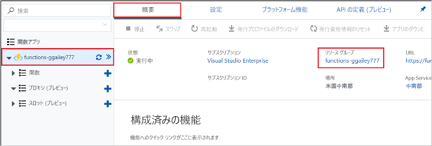

このコレクションの他のクイックスタートは、このクイックスタートに基づいています。 クイック スタート、チュートリアル、またはこのクイック スタートで作成したサービスのいずれかでの作業を引き続き行う場合は、リソースをクリーンアップしないでください。

Azure の "*リソース*" とは、関数アプリ、関数、ストレージ アカウントなどのことを指します。 これらは "*リソース グループ*" に分類されており、グループを削除することでグループ内のすべてのものを削除できます。 

これらのクイックスタートを完了するためにリソースを作成しました。 これらのリソースには、[アカウントの状態](https://azure.microsoft.com/account/)と[サービスの価格](https://azure.microsoft.com/pricing/)に応じて課金される場合があります。 リソースの必要がなくなった場合にそれらを削除する方法を、次に示します。

1. Azure Portal で、 **[リソース グループ]** ページに移動します。 

   Function App ページからこのページに移動するには、 **[概要]** タブを選択してから、 **[リソース グループ]** の下にあるリンクを選択します。

   

   ダッシュボードからこのページに移動するには、 **[リソース グループ]** を選択してから、このクイックスタート用に使用したリソース グループを選択します。

2. **[リソース グループ]** ページで、含まれているリソースの一覧を確認し、削除するものであることを確認します。
 
3. **[リソース グループの削除]** を選択し、指示に従います。

   削除には数分かかることがあります。 実行されると、通知が数秒間表示されます。 ページの上部にあるベルのアイコンを選択して、通知を表示することもできます。
