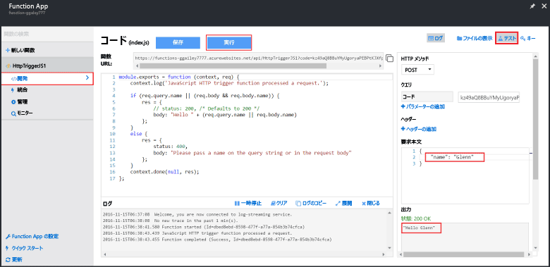

Azure Functions クイック スタートには機能コードが含まれているため、新しい関数をすぐにテストできます。

1. **[開発]** タブで **[コード]** ウィンドウを確認すると、用意されたコードでは、HTTP 要求で *name* 値をメッセージ本文またはクエリ文字列で渡す必要があることがわかります。 関数を実行すると、応答メッセージでこの値が返されます。 次に示す例は、JavaScript 関数です。
   
2. **[テスト]** をクリックすると、その関数について組み込みの HTTP テスト要求ウィンドウが表示されます。
 
    

3. **[要求本文]** ボックスで *name* プロパティの値を自分の名前に変更して、**[実行]** をクリックします。 テスト HTTP 要求によって実行がトリガーされ、ログに情報が書き込まれて、"hello..." という応答が **[出力]** に表示されます。 

4. 同じ関数の実行を HTTP テスト ツールまたは別のブラウザー ウィンドウからトリガーするには、**[開発]** タブから **[関数の URL]** の値をコピーしてツールまたはブラウザーのアドレス バーに貼り付けます。 その URL にクエリ文字列値 `&name=yourname` を追加して、要求を実行します。 同じ情報がログに書き込まれ、同じ文字列が応答メッセージの本文に含まれていることに注意してください。

    
