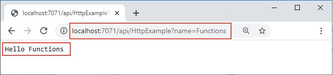

## <a name="run-the-function-locally"></a>関数をローカルで実行する

*LocalFunctionProj* フォルダーから、ローカルの Azure Functions ランタイム ホストを起動して関数を実行します。

::: zone pivot="programming-language-csharp,programming-language-powershell,programming-language-javascript,programming-language-python"
```
func host start
```
::: zone-end

::: zone pivot="programming-language-typescript"
```
npm install
npm start
```
::: zone-end

::: zone pivot="programming-language-java"
```
mvn clean package 
mvn azure-functions:run
```
::: zone-end

出力の最後の方に、次の行があります。 

<pre>
...

Now listening on: http://0.0.0.0:7071
Application started. Press Ctrl+C to shut down.

Http Functions:

        HttpExample: [GET,POST] http://localhost:7071/api/HttpExample
...

</pre>

>[!NOTE]  
> HttpExample が以下のように表示されない場合、プロジェクトのルート フォルダー以外からホストを起動したと考えられます。 その場合は **Ctrl** + **C** キーを使用してホストを停止し、プロジェクトのルート フォルダーに移動して、前出のコマンドを再度実行してください。

この出力から `HttpExample` 関数の URL をブラウザーにコピーし、クエリ文字列 `?name=<your-name>` を追加して、URL 全体を `http://localhost:7071/api/HttpExample?name=Functions` のようにします。 `Hello Functions` のようなメッセージがブラウザーに表示されます。



要求を行うと、プロジェクトを起動したターミナルにもログ出力が表示されます。

準備が完了したら、**Ctrl** + **C** キーを押し、`y` を選択して関数ホストを停止してください。
