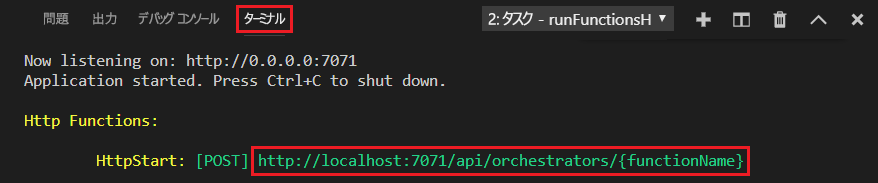
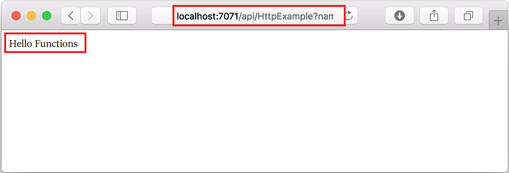

## 関数をローカルで実行する

Visual Studio Code を [Azure Functions Core Tools](../articles/azure-functions/functions-run-local.md) と統合することで、このプロジェクトをローカルの開発用コンピューター上で実行してから、Azure に発行することができます。

1. 関数を呼び出すには、F5 キーを押して関数アプリ プロジェクトを起動します。 Core Tools からの出力が**ターミナル** パネルに表示されます。

1. Azure Functions Core Tools をまだインストールしていない場合は、プロンプトで **[インストール]** を選択します。 Core Tools がインストールされると、アプリが**ターミナル** パネルで起動します。 HTTP によってトリガーされる関数の URL エンドポイントがローカルで実行されていることを確認できます。 

    

1. Core Tools が実行されている状態で、次の URL に移動して、`?name=Functions` クエリ文字列を含む GET 要求を実行します。

    <http://localhost:7071/api/HttpExample?name=Functions>

1. 応答が返され、ブラウザーに次のように表示されます。

    

1. 要求に関する情報が **[ターミナル]** パネルに表示されます。

    ![[ターミナル] パネルでの関数の実行](./media/functions-run-function-test-local-vs-code/function-execution-terminal.png)

1. Ctrl + C キーを押して Core Tools を停止し、デバッガーの接続を解除します。
