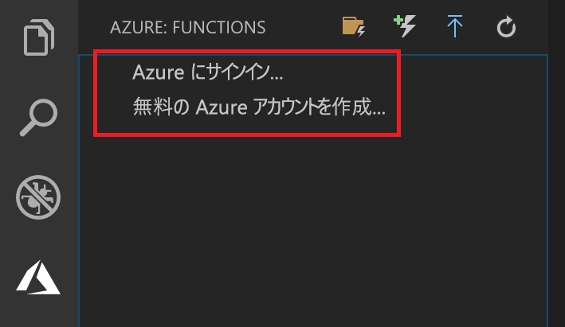

## Azure へのサインイン

アプリを発行するには、Azure にサインインしておく必要があります。 

1. まだサインインしていない場合は、アクティビティ バーの Azure アイコンを選択し、 **[Azure: Functions]** 領域で、 **[Azure にサインイン...]** を選択します。アカウントがない場合は、**無料の Azure アカウントを作成する**ことができます。 

    

    既にサインインしている場合は、次のセクションに進んでください。

1. ブラウザーでプロンプトが表示されたら、ご利用の Azure アカウントを選択し、その Azure アカウントの資格情報を使用してサインインします。 

1. 正常にサインインしたら、新しいブラウザー ウィンドウを閉じてかまいません。 ご利用の Azure アカウントに属しているサブスクリプションがサイド バーに表示されます。
