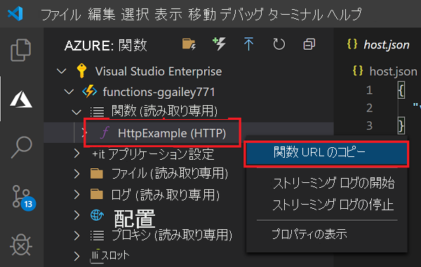
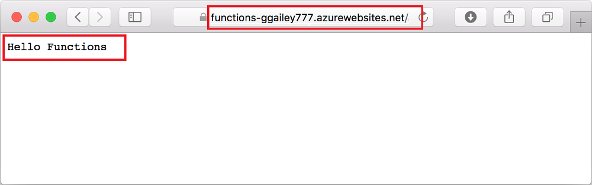

## <a name="run-the-function-in-azure"></a>Azure で関数を実行する

1. **[Azure: Functions]** 領域 (サイド バー内) に戻り、サブスクリプションの下にある新しい関数アプリを展開します。 **[Functions]** を展開し、 **[HttpExample]** を右クリック (Windows) または <kbd>Ctrl キーを押しながら</kbd>クリック (macOS) して、 **[Copy function URL]\(関数 URL のコピー\)** を選択します。

    

1. HTTP 要求の URL をブラウザーのアドレス バーに貼り付け、この URL の最後に `name` クエリ文字列を `?name=Functions` として追加して、要求を実行します。 HTTP によってトリガーされる関数を呼び出す URL は、次の形式である必要があります。

    ```http
    http://<FUNCTION_APP_NAME>.azurewebsites.net/api/httpexample?name=Functions
    ```

    関数によって返されたリモート GET 要求に対するブラウザーでの応答を次の例に示します。

    
