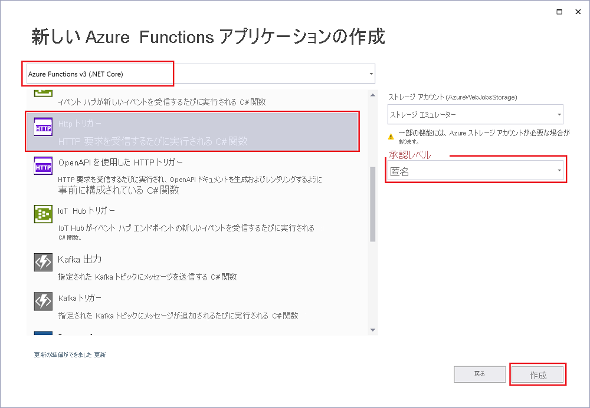

Visual Studio の Azure Functions プロジェクト テンプレートでは、Azure の関数アプリに発行できるプロジェクトを作成します。 関数アプリを使用すると、リソースの管理、デプロイ、スケーリング、および共有を容易にするための論理ユニットとして関数をグループ化できます。

1. Visual Studio メニューで、 **[ファイル]**  >  **[新規]**  >  **[プロジェクト]** を選択します。

1. **[新しいプロジェクトの作成]** の検索ボックスに「*functions*」と入力し、**Azure Functions** テンプレートを選択してから、 **[次へ]** を選択します。

1. **[新しいプロジェクトの構成]** で、プロジェクトの **プロジェクト名** を入力し、 **[作成]** を選択します。 関数アプリ名は、C# 名前空間として有効である必要があります。そのため、アンダースコア、ハイフン、その他の英数字以外の文字は使用しないでください。

1. **[新しい Azure Functions アプリケーションの作成]** 設定で、次の表の値を使用します。

    | 設定      | 値  | 説明                      |
    | ------------ |  ------- |----------------------------------------- |
    | **Functions ランタイム** | **Azure Functions v3  (.NET Core)** | この値は、.NET Core 3.x をサポートする Azure Functions のバージョン 3.x ランタイムを使用する関数プロジェクトを作成します。 Azure Functions 1.x では、.NET Framework がサポートされます。 詳細については、「[Azure Functions ランタイム バージョンをターゲットにする方法](../articles/azure-functions/functions-versions.md)」をご覧ください。   |
    | **関数テンプレート** | **HTTP トリガー** | この値は、HTTP 要求によってトリガーされる関数を作成します。 |
    | **ストレージ アカウント (AzureWebJobsStorage)**  | **ストレージ エミュレーター** | Azure Function にはストレージ アカウントが必要であるため、プロジェクトを Azure に発行するときに割り当てられるか、作成されます。 HTTP トリガーによって、Azure Storage アカウントの接続文字列が使用されることはありません。その他のすべてのトリガーの種類には、有効な Azure Storage アカウントの接続文字列が必要です。  |
    | **承認レベル** | **Anonymous** | 作成される関数を、すべてのクライアントがキーを使用せずにトリガーできます。 この承認設定により、新しい関数のテストが容易になります。 キーと承認の詳細については、「[承認キー](../articles/azure-functions/functions-bindings-http-webhook-trigger.md#authorization-keys)」と [HTTP と Webhook のバインド](../articles/azure-functions/functions-bindings-http-webhook.md)に関するページをご覧ください。 |
    
    
    

    **[承認レベル]** を **[匿名]** に設定していることを確認します。 **関数** の既定のレベルを選択した場合、関数エンドポイントにアクセスする要求で、[関数キー](../articles/azure-functions/functions-bindings-http-webhook-trigger.md#authorization-keys)を提示する必要があります。

1. **[作成]** を選択して、関数プロジェクトと HTTP トリガー関数を作成します。
