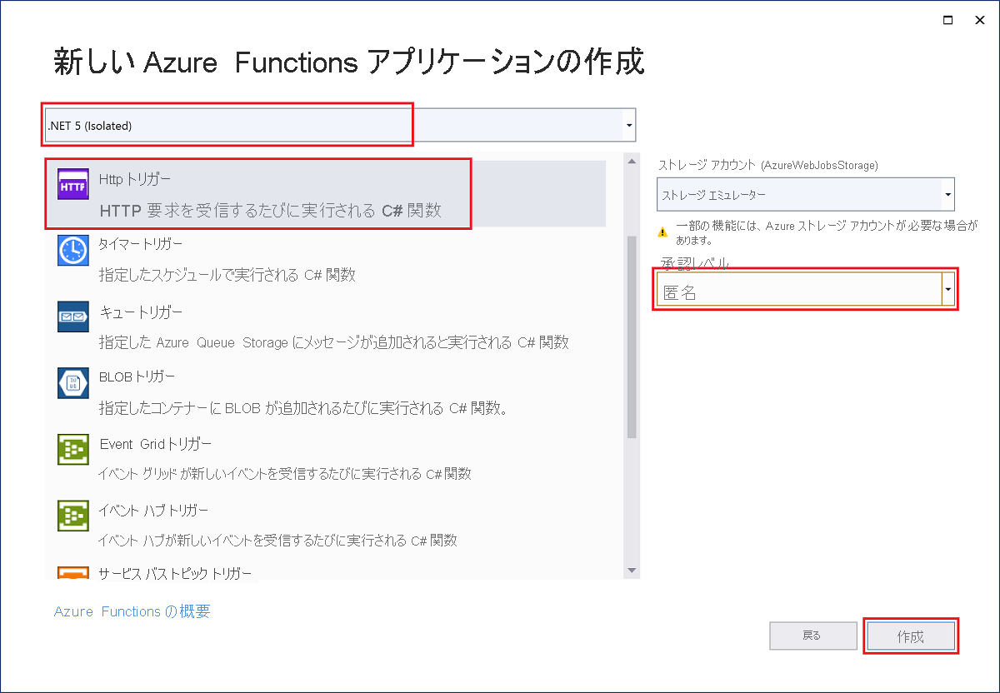

Visual Studio の Azure Functions プロジェクト テンプレートを使用すると、Azure の関数アプリに発行できる C# クラス ライブラリ プロジェクトを作成できます。 関数アプリを使用すると、リソースの管理、デプロイ、スケーリング、および共有を容易にするための論理ユニットとして関数をグループ化できます。

1. Visual Studio メニューで、 **[ファイル]**  >  **[新規]**  >  **[プロジェクト]** を選択します。

1. **[新しいプロジェクトの作成]** の検索ボックスに「*functions*」と入力し、**Azure Functions** テンプレートを選択してから、 **[次へ]** を選択します。

1. **[新しいプロジェクトの構成]** で、プロジェクトの **プロジェクト名** を入力し、 **[作成]** を選択します。 関数アプリ名は、C# 名前空間として有効である必要があります。そのため、アンダースコア、ハイフン、その他の英数字以外の文字は使用しないでください。

1. **[新しい Azure Functions アプリケーションの作成]** 設定で、次の表の値を使用します。

    # [インプロセス](#tab/in-process) 

    | 設定      | 値  | 説明                      |
    | ------------ |  ------- |----------------------------------------- |
    | **.NET のバージョン** | **.NET Core 3 (LTS)** | この値により、Azure Functions ランタイムのバージョン 3.x でインプロセスを実行する関数プロジェクトが作成されます。 Azure Functions 1.x では、.NET Framework がサポートされます。 詳細については、「[Azure Functions ランタイム バージョンをターゲットにする方法](../articles/azure-functions/functions-versions.md)」をご覧ください。   |
    | **関数テンプレート** | **HTTP トリガー** | この値は、HTTP 要求によってトリガーされる関数を作成します。 |
    | **ストレージ アカウント (AzureWebJobsStorage)**  | **ストレージ エミュレーター** | Azure の関数アプリにはストレージ アカウントが必要であるため、プロジェクトを Azure に発行する際に割り当てられるか、作成されます。 HTTP トリガーによって、Azure Storage アカウントの接続文字列が使用されることはありません。その他のすべてのトリガーの種類には、有効な Azure Storage アカウントの接続文字列が必要です。  |
    | **承認レベル** | **Anonymous** | 作成される関数を、すべてのクライアントがキーを使用せずにトリガーできます。 この承認設定により、新しい関数のテストが容易になります。 キーと承認の詳細については、「[承認キー](../articles/azure-functions/functions-bindings-http-webhook-trigger.md#authorization-keys)」と [HTTP と Webhook のバインド](../articles/azure-functions/functions-bindings-http-webhook.md)に関するページをご覧ください。 |
    
    
    

    # [分離プロセス](#tab/isolated-process)

    | 設定      | 値  | 説明                      |
    | ------------ |  ------- |----------------------------------------- |
    | **.NET のバージョン** | **.NET 5 (Isolated)** | この値により、.NET 5.0 をサポートする分離プロセスで実行される関数プロジェクトが作成されます。 詳細については、「[Azure Functions ランタイム バージョンをターゲットにする方法](../articles/azure-functions/functions-versions.md)」をご覧ください。   |
    | **関数テンプレート** | **HTTP トリガー** | この値は、HTTP 要求によってトリガーされる関数を作成します。 |
    | **ストレージ アカウント (AzureWebJobsStorage)**  | **ストレージ エミュレーター** | Azure の関数アプリにはストレージ アカウントが必要であるため、プロジェクトを Azure に発行する際に割り当てられるか、作成されます。 HTTP トリガーによって、Azure Storage アカウントの接続文字列が使用されることはありません。その他のすべてのトリガーの種類には、有効な Azure Storage アカウントの接続文字列が必要です。  |
    | **承認レベル** | **Anonymous** | 作成される関数を、すべてのクライアントがキーを使用せずにトリガーできます。 この承認設定により、新しい関数のテストが容易になります。 キーと承認の詳細については、「[承認キー](../articles/azure-functions/functions-bindings-http-webhook-trigger.md#authorization-keys)」と [HTTP と Webhook のバインド](../articles/azure-functions/functions-bindings-http-webhook.md)に関するページをご覧ください。 |
    
    
    

    ---

    **[承認レベル]** を **[匿名]** に設定していることを確認します。 **関数** の既定のレベルを選択した場合、関数エンドポイントにアクセスする要求で、[関数キー](../articles/azure-functions/functions-bindings-http-webhook-trigger.md#authorization-keys)を提示する必要があります。

1. **[作成]** を選択して、関数プロジェクトと HTTP トリガー関数を作成します。
