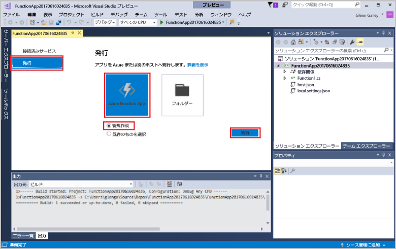
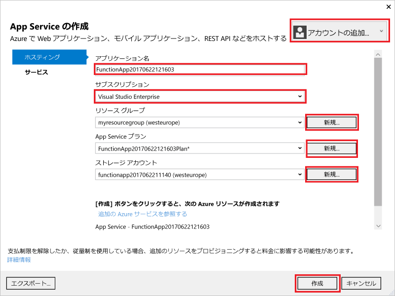
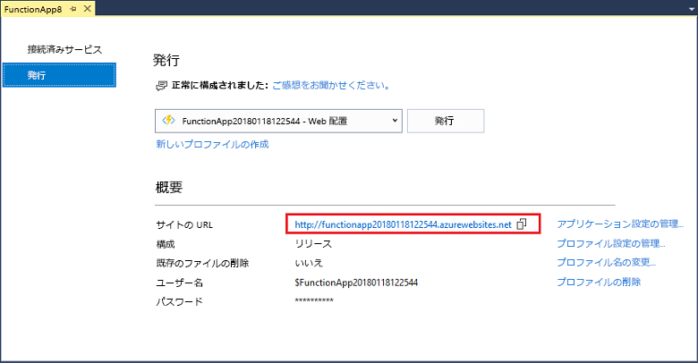

1. **ソリューション エクスプローラー**で、プロジェクトを右クリックし、**[発行]** を選択します。 **[新規作成]** を選択し、**[発行]** をクリックします。 

    

2. まだ Visual Studio を Azure アカウントに接続していない場合は、**[アカウントの追加]** をクリックします。  

3. **[App Service の作成]** ダイアログでは、次の表に指定されているように**ホスティング**設定を使用してください。 

    

    | 設定      | 推奨値  | Description                                |
    | ------------ |  ------- | -------------------------------------------------- |
    | **アプリ名** | グローバルに一意の名前 | 新しい関数アプリを一意に識別する名前。 |
    | **サブスクリプション** | サブスクリプションの選択 | 使用する Azure サブスクリプション。 |
    | **[リソース グループ](../articles/azure-resource-manager/resource-group-overview.md)** | myResourceGroup |  関数アプリを作成するリソース グループの名前。 |
    | **[App Service プラン](../articles/azure-functions/functions-scale.md)** | 従量課金プラン | 新しいプランを作成する場合は、必ず **[サイズ]** の下の **[重量課金プラン]** を選択してください。  |
    | **[ストレージ アカウント](../articles/storage/common/storage-create-storage-account.md#create-a-storage-account)** | グローバルに一意の名前 | 既存のストレージ アカウントを使用するか、新しいストレージ アカウントを作成します。   |

4. **[作成]** をクリックして、これらの設定で Azure に関数アプリを作成します。 プロビジョニングが完了したら、**サイト URL** の値を書き留めておきます。これが Azure における関数アプリのアドレスになります。 

    
