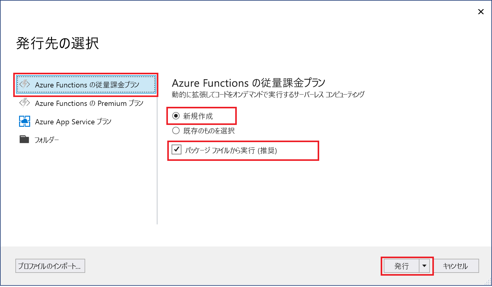
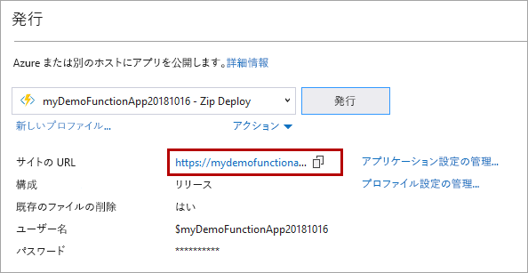

1. **ソリューション エクスプローラー**で、プロジェクトを右クリックし、**[発行]** を選択します。

2. **[Azure 関数アプリ]** を選択し、**[新規作成]** を選択して、**[発行]** を選択します。

    

    **[Run from Zip]\(Zip から実行\)** を有効にすると、Azure の関数アプリはデプロイ パッケージから直接実行されます。 詳細については、「[Run your Azure Functions from a package file](../articles/azure-functions/run-functions-from-deployment-package.md)」(パッケージ ファイルから Azure Functions を実行する) を参照してください。
     
    >[!CAUTION]
    >**[既存のものを選択]** を選択すると、Azure の既存の関数アプリ内のすべてのファイルがローカル プロジェクトのファイルによって上書きされます。 このオプションは、既存の関数アプリへの更新を再発行する場合にのみ使用します。

3. まだ Visual Studio を Azure アカウントに接続していない場合は、**[アカウントの追加...]** を選択します。

4. **[App Service の作成]** ダイアログで、画像の下の表に指定されているように**ホスティング**設定を使用してください。

    ![[App Service の作成] ダイアログ](./media/functions-vstools-publish/functions-visual-studio-publish.png)

    | Setting      | 推奨値  | 説明                                |
    | ------------ |  ------- | -------------------------------------------------- |
    | **アプリ名** | グローバルに一意の名前 | 新しい関数アプリを一意に識別する名前。 |
    | **サブスクリプション** | サブスクリプションの選択 | 使用する Azure サブスクリプション。 |
    | **[リソース グループ](../articles/azure-resource-manager/resource-group-overview.md)** | myResourceGroup |  関数アプリを作成するリソース グループの名前。 新しいリソース グループを作成する場合は、**[新規]** を選択します。|
    | **[App Service プラン](../articles/azure-functions/functions-scale.md)** | 従量課金プラン | **[新規]** をクリックしてサーバーレス プランを作成した後は、必ず **[サイズ]** の下の **[従量課金プラン]** を選択します。 また、[[地域]](https://azure.microsoft.com/regions/) で、自分に近いか、または自分の関数がアクセスする他のサービスに近い **[場所]** を選択します。 **[従量課金プラン]** 以外のプランで実行する場合は、[関数アプリのスケーリング](../articles/azure-functions/functions-scale.md)を管理する必要があります。  |
    | **[ストレージ アカウント](../articles/storage/common/storage-quickstart-create-account.md)** | 汎用ストレージ アカウント | Functions ランタイムには Azure Storage アカウントが必要です。 **[新規]** をクリックして汎用ストレージ アカウントを作成します。 または、[ストレージ アカウントの要件](../articles/azure-functions/functions-scale.md#storage-account-requirements)を満たす既存のアカウントを使用することもできます。  |

5. **[作成]** をクリックして、これらの設定で Azure に関数アプリと関連リソースを作成し、関数プロジェクト コードをデプロイします。 

6. デプロイが完了したら、**[サイトの URL]** の値を書き留めておきます。これが Azure における関数アプリのアドレスになります。

    
