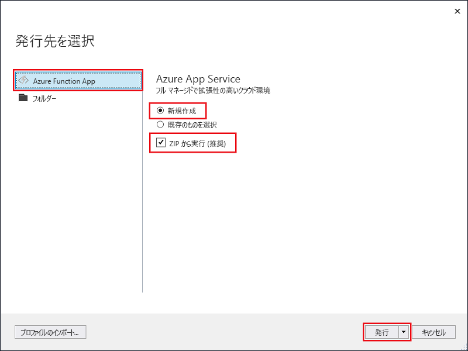

1. **ソリューション エクスプローラー**で、プロジェクトを右クリックし、**[発行]** を選択します。

2. **[Azure 関数アプリ]** を選択し、**[新規作成]** を選択して、**[発行]** を選択します。

    

2. まだ Visual Studio を Azure アカウントに接続していない場合は、**[アカウントの追加...]** を選択します。

3. **[App Service の作成]** ダイアログで、画像の下の表に指定されているように**ホスティング**設定を使用してください。

    ![[App Service の作成] ダイアログ](./media/functions-vstools-publish/functions-vstools-publish.png)

    | Setting      | 推奨値  | 説明                                |
    | ------------ |  ------- | -------------------------------------------------- |
    | **アプリ名** | グローバルに一意の名前 | 新しい関数アプリを一意に識別する名前。 |
    | **サブスクリプション** | サブスクリプションの選択 | 使用する Azure サブスクリプション。 |
    | **[リソース グループ](../articles/azure-resource-manager/resource-group-overview.md)** | myResourceGroup |  関数アプリを作成するリソース グループの名前。 新しいリソース グループを作成する場合は、**[新規]** を選択します。|
    | **[App Service プラン](../articles/azure-functions/functions-scale.md)** | 従量課金プラン | **[新規]** をクリックしてプランを作成した後は、必ず **[サイズ]** の下の **[従量課金プラン]** を選択してください。 また、[[地域]](https://azure.microsoft.com/regions/) で、自分に近いか、または自分の関数がアクセスする他のサービスに近い **[場所]** を選択します。  |
    | **[ストレージ アカウント](../articles/storage/common/storage-create-storage-account.md#create-a-storage-account)** | 汎用ストレージ アカウント | Functions ランタイムには Azure Storage アカウントが必要です。 **[新規]** をクリックして汎用ストレージ アカウントを作成するか、または既存のアカウントを使用します。  |

4. **[作成]** をクリックして、これらの設定で Azure に関数アプリと関連リソースを作成し、関数プロジェクト コードをデプロイします。 

5. デプロイが完了したら、**[サイトの URL]** の値を書き留めておきます。これが Azure における関数アプリのアドレスになります。

    
